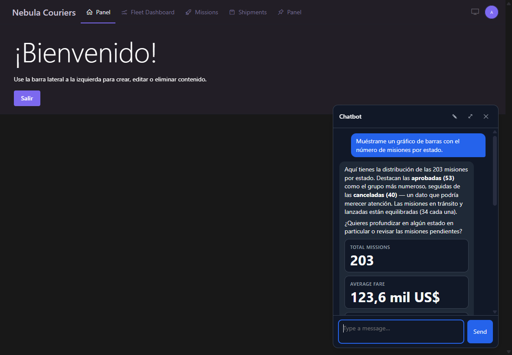
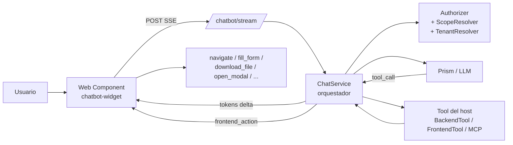
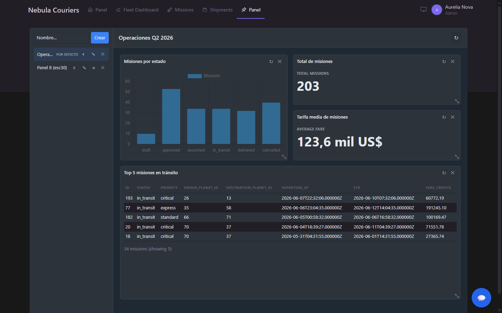
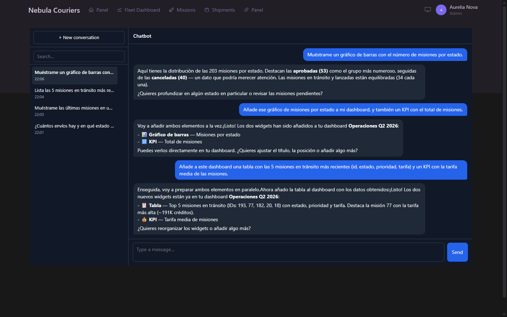

# rnkr69/lara-chatbot

*[English](README.md) · Español*

[](https://packagist.org/packages/rnkr69/lara-chatbot)


Un paquete de Laravel (línea pre-estable `0.x`) que añade un chat asistido por
LLM a tu aplicación. Invoca las **backend tools** del host bajo una cascada de
autorización aplicada por el paquete, ejecuta **frontend tools** (navegación,
formularios, descargas, modales) desde un Web Component agnóstico al stack
(Blade, Livewire, Inertia + Vue/React), y permite a los usuarios **fijar
resultados en un dashboard personal** que se re-ejecuta bajo los mismos permisos.

Hecho como proyecto personal. Es funcional y está cubierto por tests, pero
todavía pre-`1.0`, así que un bump MINOR puede incluir cambios incompatibles
mientras esté en la línea `0.x`.

<p align="center">
  
  <br>
  <em>El widget flotante llama a una backend tool y renderiza bloques tipados (KPIs, gráficos, tablas) en línea.</em>
</p>

---

## Propuesta de valor

| Sin el paquete | Con el paquete |
|---|---|
| **Riesgo de filtrar datos** a usuarios no autorizados cuando un chatbot consulta el backend. | **Diferenciador principal:** una cascada `permission → scope → tenant → ownership` aplicada por el paquete antes de invocar cualquier tool. Las tools del host nunca ven datos fuera del alcance del usuario. |
| Cada proyecto reinventa el bot, las tools, el widget y el cableado de autorización. | Un contrato común (`BackendTool`, `FrontendTool`, `Authorizer`, `ScopeResolver`, `TenantResolver`). El proyecto solo aporta sus tools de dominio. |
| Acoplamiento a un único proveedor LLM (Anthropic SDK, OpenAI, etc.). | Prism `^0.100` por debajo: Anthropic, OpenAI, Groq, Gemini, Mistral, Ollama. Cambiar de proveedor es un cambio de config. Plan B documentado en [`docs/prism-contingency.es.md`](docs/prism-contingency.es.md). |
| Widget acoplado a un framework JS. | Web Component vanilla (~28 KB gzip el widget) en shadow DOM. Sin React/Vue en runtime. |
| Confirmaciones ad-hoc por feature. | `confirmation=auto/confirm/manual` declarativo, banner unificado, fila de auditoría con TTL. *(Hoy aplica a las frontend tools; las backend tools son solo `auto` — Confirm/Manual para backend está en el backlog.)* |

---

## Estado del proyecto

| | |
|---|---|
| **Versión** | `0.4.1` (pre-estable; un bump MINOR puede romper en la línea `0.x`) |
| **Cobertura de tests** | Pest (PHP) + Vitest (JS); 487 vitest + objetivo ≥75% en el core PHP |
| **CI** | `.github/workflows/ci.yml` (lint + matriz de tests + build JS) |
| **Eval harness (calidad de tool-calling del LLM)** | 8 fixtures YAML. El modo fake (verifica el orquestador) corre en CI por PR. El modo live llama al LLM real y vuelca una traza por fixture a `tests/Evals/last-live-run.json`. Backlog: ≥20 fixtures + matriz multi-modelo + seguimiento de baseline. Ver [`tests/Evals/README.es.md`](tests/Evals/README.es.md). |
| **Telemetría de coste por usuario** | Persiste `tokens_in`/`tokens_out` por mensaje, evento `MessagePersisted` para sinks externos, comando `chatbot:cost-report --since=YYYY-MM-DD [--format=table\|json\|csv]`. Ver [`docs/telemetry.es.md`](docs/telemetry.es.md). |
| **Accesibilidad (WCAG)** | No auditada. Etiquetas ARIA básicas en los botones del widget. La auditoría WCAG 2.1 AA está en el backlog `v0.5+`. |
| **Camino a `1.0`** | Un ciclo de release sin cambios incompatibles en los 7 puntos de la "Política de versionado" (ver `CHANGELOG.md`). |

---

## Instalación

> Detalle paso a paso en [`docs/getting-started.es.md`](docs/getting-started.es.md).
> En la práctica la primera integración real (instalar + elegir widget vs página +
> escribir un `ScopeResolver` + `TenantResolver` opcional + cablear el page context +
> escribir tu primera tool con sus permisos) se mide en horas, no en minutos.
> El asistente del paquete en sí toma 5 minutos; el resto es trabajo del host.

### 1. Requiere el paquete

```bash
composer require rnkr69/lara-chatbot
php artisan chatbot:install      # asistente interactivo (9 sub-pasos idempotentes)
php artisan migrate
php artisan chatbot:doctor       # health check (config + auth + DB + assets + LLM + tools)
```

### 2. Inyecta el widget en tu layout

```blade
{{-- resources/views/layouts/app.blade.php, antes de </body> --}}
<chatbot-widget data-endpoint="{{ route('chatbot.stream') }}"></chatbot-widget>
<script src="{{ asset('vendor/chatbot/chatbot-widget.js') }}" defer></script>
```

### 3. Tu primera tool

```bash
php artisan chatbot:make:tool ListMyInvoices
```

```php
// app/Chatbot/Tools/ListMyInvoicesTool.php
public function name(): string { return 'list_my_invoices'; }
public function description(): string { return 'List the user invoices.'; }
public function permissions(): array { return ['invoices.view']; }
public function defaultScope(): AccessScope { return AccessScope::Self; }

public function handle(array $args, ToolContext $ctx): ToolResult
{
    $rows = $this->accessibleQuery(Invoice::query(), $ctx)->limit(20)->get();
    return ToolResult::success(['items' => $rows->toArray()]);
}
```

Recarga, abre el widget, pregunta "¿qué facturas tengo?" — y el bot llama a la
tool, aplica permisos y scope, y responde con tus datos.

---

## Cómo funciona



Detalle en [`docs/getting-started.es.md §4`](docs/getting-started.es.md#4-cómo-funciona).

---

## Capturas

**Dashboard personal** — fija bloques desde el chat y re-ejecútalos al abrir
bajo la misma cascada de autorización. Construido y reordenado enteramente desde
lenguaje natural vía las tools conversacionales del dashboard.

<p align="center">
  
</p>

**Modo página** — la vista dedicada `GET /chatbot` con una barra lateral de
conversaciones, junto al widget flotante.

<p align="center">
  
</p>

---

## Documentación

| Si necesitas… | Lee |
|---|---|
| **Empezar desde cero** | [`docs/getting-started.es.md`](docs/getting-started.es.md) |
| Entender la cascada de autorización | [`docs/authorization.es.md`](docs/authorization.es.md) |
| Construir backend tools (incluyendo bulk + MCP) | [`docs/backend-tools.es.md`](docs/backend-tools.es.md) |
| Construir frontend tools | [`docs/FRONTEND_TOOLS.es.md`](docs/FRONTEND_TOOLS.es.md) |
| Renderizar bloques tipados (incluyendo `kpi` + `chart`) | [`docs/block-renderers.es.md`](docs/block-renderers.es.md) |
| Dashboard personal (fijar + replay) | [`docs/dashboard.es.md`](docs/dashboard.es.md) |
| Inyectar page context en el LLM | [`docs/page-context.es.md`](docs/page-context.es.md) |
| Pedir confirmación al usuario | [`docs/confirmation-flow.es.md`](docs/confirmation-flow.es.md) |
| Conectar servidores MCP externos | [`docs/mcp.es.md`](docs/mcp.es.md) |
| Personalizar el widget | [`docs/WIDGET.es.md`](docs/WIDGET.es.md) |
| Integración con el admin Backpack | [`docs/integrations/backpack.es.md`](docs/integrations/backpack.es.md) |
| Telemetría de coste + evento `MessagePersisted` | [`docs/telemetry.es.md`](docs/telemetry.es.md) |
| Desplegar a producción | [`docs/deployment.es.md`](docs/deployment.es.md) |
| Algo va mal | [`docs/troubleshooting.es.md`](docs/troubleshooting.es.md) |
| Distribuir versiones del paquete | [`docs/distribution.es.md`](docs/distribution.es.md) |
| Correr la suite de tests | [`docs/testing.es.md`](docs/testing.es.md) |

---

## Requisitos

- PHP **^8.2** (Laravel 13 requiere **^8.3**). Probado en 8.2 / 8.3 / 8.4.
- Laravel **^12.0** o **^13.0** (ambos probados en CI), o **^11.0** con una salvedad — ver abajo.
- Un proveedor LLM soportado por [Prism](https://github.com/prism-php/prism):
  Anthropic, OpenAI, Groq, Gemini, Mistral, Ollama.
- MySQL ≥ 8.0, PostgreSQL ≥ 13 o SQLite.

> **Salvedad Laravel 11.** El paquete todavía permite `^11.0`, pero Laravel 11
> alcanzó el fin de vida de seguridad (~marzo 2026) y toda su línea de releases
> arrastra ahora un aviso sin parchear. Composer reciente se niega a instalar
> paquetes marcados con avisos, así que una **instalación limpia en Laravel 11
> falla** salvo que el host se salte el bloqueo. Por eso CI solo ejercita Laravel
> 12 y 13. Si debes correr en Laravel 11, consulta la nota de instalación en
> [`docs/getting-started.es.md`](docs/getting-started.es.md#laravel-11). La
> recomendación es actualizar a Laravel 12 o 13.

---

## Capacidades

> Criterio: una capacidad es **estable** si está implementada y ejercitada
> end-to-end por la suite de tests (Pest + Vitest) con un contrato documentado.
> Las capacidades diseñadas pero aún no probadas en batalla se marcan aparte más
> abajo. Cualquier limitación conocida de alcance o versión va en su propia
> entrada como salvedad.

### Estable (implementado + probado)

- **Streaming SSE** — `POST /chatbot/stream` con tokens incrementales; frames
  `tool_call`/`tool_result`/`frontend_action`/`block`/`done`. Persistencia de
  conversación e historial.
- **Backend Tools** — clases del host con la cascada `permission → scope →
  tenant → ownership` aplicada antes de cada invocación. JSON Schema → Validator.
  Patrón bulk documentado. *Limitación actual: solo se ofrece `confirmation =
  Auto` al LLM; el flujo Confirm/Manual para backend está en el backlog.*
- **Frontend Tools** — 8 primitivas integradas (`navigate`, `fill_form`,
  `show_toast`, `download_file`, `open_modal`, `render_block`,
  `toggle_visibility`, `invoke_host_action`). Cada primitiva devuelve un
  `PrimitiveResult` estructurado — los fallos vuelven al LLM en vez de ser
  no-ops silenciosos. `DownloadFileTool` es fail-secure.
- **Bloques tipados** — renderers integrados para `text`, `actions`, `card`,
  `table`, `list`, `chart`, `kpi`. `registerBlockRenderer` para custom + slot
  HTML (`<template data-chatbot-block-template>`).
- **Page Context API** — meta tag declarativo (`chatbot:context`) +
  `window.Chatbot.setPageContext()` programático (deep merge en el primer
  nivel). El sanitizer descarta closures/resources/NaN/INF; truncado a
  `chatbot.limits.page_context_kb`.
- **Confirmaciones** — `auto`/`confirm`/`manual` para frontend tools, banner
  unificado, fila de auditoría con TTL (10 min pendiente / 24 h ejecutada),
  endpoint idempotente, sección `## Pending actions` en el system prompt.
- **Widget** — Web Component (`<chatbot-widget>`) en shadow DOM, ~28 KB gzip.
  Resolución de tema explícito → `<html data-bs-theme>` →
  `prefers-color-scheme` con reactividad en runtime. Modo flotante + modo
  página (`GET /chatbot`) con barra lateral de conversaciones y deep-link vía
  `?conversation_id=N`. Estado sincronizado entre pestañas vía localStorage.
- **Autorización** — cascada tridimensional (permission vía Spatie / Gate /
  custom, scope `self`/`team`/`all` vía el `ScopeResolver` del host, ownership
  vía `Policy::can()`). Guard en boot si una tool con `tenantScope=true` no
  tiene un `TenantResolver` enlazado.
- **Gateway LLM** — Prism (`^0.100`) abstrae Anthropic / OpenAI / Groq /
  Gemini / Mistral / Ollama. Plan B documentado en
  [`docs/prism-contingency.es.md`](docs/prism-contingency.es.md).
- **Dashboard personal** — fija bloques desde el chat (📌), grid drag-and-drop
  con gridstack.js (12 col), `ReplayService` re-ejecuta la tool de cada widget
  cuando el dashboard se abre bajo la misma cascada de autorización. Múltiples
  dashboards por usuario, refresco `on_open`/`manual`/`never`, ruta
  `/chatbot/dashboard` con un bundle separado (~110 KB gzip). Cinco backend
  tools conversacionales (`add_to_dashboard`, `edit_widget`, `delete_widget`,
  `edit_dashboard`, `delete_dashboard`) para crear/editar el dashboard desde
  lenguaje natural. Refresco en cliente sin F5 vía el evento
  `chatbot:dashboard-mutation`. Ver [`docs/dashboard.es.md`](docs/dashboard.es.md).
  *Salvedad de superficie: bundle de dashboard separado ~110 KB gz + 5 tools
  CRUD; las 5 tools conversacionales son las features más recientes del ciclo
  pre-0.4 y las menos probadas en batalla.*
- **Puente i18n PHP → JS** — el blade emite `data-i18n` JSON-encoded desde
  `__('chatbot::chatbot')` y el bundle drena cada subárbol (`dashboard.sidebar`,
  `dashboard.card`, etc.) al mounter correspondiente. Defaults TS inline como
  fallback. *Salvedad de alcance: ejercitado dentro del bundle de dashboard; no
  extendido aún a otras superficies (widget de chat, página dedicada).*
- **Integración Backpack** — `BackpackPageContextProvider` opt-in emite
  `crud.entity`/`crud.form`/`crud.filters` con FKs pre-resueltos (cap 200);
  modo `layout` de dashboard con tema Backpack; sync en vivo de
  `crud.selected_ids`. *Salvedad de versión: validado contra Backpack 6.x; no
  probado contra 5.x o 7.x.*
- **CLI** — `chatbot:install` (asistente idempotente), `chatbot:doctor` (health
  check), `chatbot:make:tool`, `chatbot:make:scope-resolver`,
  `chatbot:make:tenant-resolver`, `chatbot:tools:list`, `chatbot:tools:test`,
  `chatbot:test-connection`, `chatbot:cleanup-actions`,
  `chatbot:scan-forms` + `chatbot:integrate-form`,
  `chatbot:decision-rules:show`, `chatbot:cost-report`.
- **Cap de bundle en build** — widget 80 KB gzip / dashboard 150 KB gzip.
  `scripts/build.mjs` falla si se excede + `scripts/check-bundle-tokens.mjs`
  verifica que los tokens críticos sobreviven a la minificación (REQUIRED por
  bundle + SHARED cross-bundle).

### Diseñado, aún no probado en batalla

- **Bridge MCP** — servidores MCP externos integrados como tools de catálogo
  bajo el prefijo `mcp.<server>.<tool>` vía `prism-php/relay`. La misma cascada
  de autorización aplicaría a las tools remotas. *Aún no ejercitado end-to-end:
  el contrato está implementado y cubierto por tests unitarios, pero no se ha
  corrido contra un servidor MCP real.*

---

## Versionado

`rnkr69/lara-chatbot` sigue [Versionado Semántico](https://semver.org), con un
matiz importante para la línea `0.x`: **mientras sea pre-`1.0`, un bump MINOR
puede contener cambios incompatibles**. La API todavía se está estabilizando
antes de `1.0`. Para producción en `0.x`, fija una versión `0.4.N` concreta y
revisa `CHANGELOG.md` antes de actualizar.

Después de `1.0.0`, los 7 puntos listados en la sección "Política de versionado"
de [`CHANGELOG.md`](CHANGELOG.md) requerirán un bump MAJOR para romperse (rutas
HTTP, contratos de tools, claves de config, atributos del web component, claves
de almacenamiento, eventos SSE, forma de las migraciones).

---

## Soporte

- Issues: por favor abre un [issue en GitHub](https://github.com/rnkr69/lara-chatbot/issues).
- Releases: etiquetadas en el repositorio. Ver [`docs/distribution.es.md`](docs/distribution.es.md).

---

## Licencia

MIT — ver [`LICENSE`](LICENSE).
