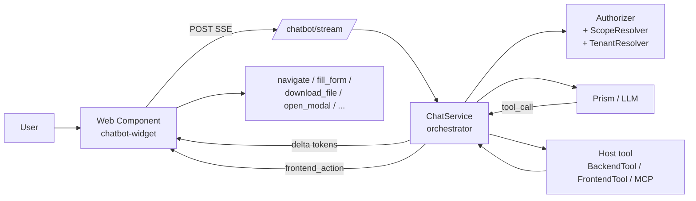

# rnkr69/lara-chatbot

*English · [Español](README.es.md)*

[](https://packagist.org/packages/rnkr69/lara-chatbot)


A Laravel package (pre-stable `0.x` line) that adds an LLM-assisted chat to your
app. It invokes the host's **backend tools** under an authorization cascade
enforced by the package, runs **frontend tools** (navigation, forms, downloads,
modals) from a stack-agnostic Web Component (Blade, Livewire, Inertia + Vue/React),
and lets users **pin results to a personal dashboard** that re-executes under the
same permissions.

Built as a personal side project. It is functional and test-covered, but still
pre-`1.0`, so a MINOR bump may include breaking changes while on the `0.x` line.

<p align="center">
  
  <br>
  <em>The floating widget calls a backend tool and renders typed blocks (KPIs, charts, tables) inline.</em>
</p>

---

## Value proposition

| Without the package | With the package |
|---|---|
| **Risk of leaking data** to unauthorized users when a chatbot queries the backend. | **Main differentiator:** a `permission → scope → tenant → ownership` cascade enforced by the package before invoking any tool. Host tools never see data outside the user's scope. |
| Every project reinvents the bot, the tools, the widget and the auth wiring. | A common contract (`BackendTool`, `FrontendTool`, `Authorizer`, `ScopeResolver`, `TenantResolver`). The project only contributes its domain tools. |
| Coupling to a single LLM provider (Anthropic SDK, OpenAI, etc.). | Prism `^0.100` underneath: Anthropic, OpenAI, Groq, Gemini, Mistral, Ollama. Switching providers is a config change. Plan B documented in [`docs/prism-contingency.md`](docs/prism-contingency.md). |
| Widget coupled to a JS framework. | Vanilla Web Component (~28 KB gzip widget) in shadow DOM. No React/Vue at runtime. |
| Ad-hoc confirmations per feature. | Declarative `confirmation=auto/confirm/manual`, unified banner, audit row with TTL. *(Today applies to frontend tools; backend tools are `auto` only — Confirm/Manual for backend is in the backlog.)* |

---

## Project status

| | |
|---|---|
| **Version** | `0.4.1` (pre-stable; a MINOR bump may break on the `0.x` line) |
| **Test coverage** | Pest (PHP) + Vitest (JS); 487 vitest + ≥75% target on core PHP |
| **CI** | `.github/workflows/ci.yml` (lint + test matrix + JS build) |
| **Eval harness (LLM tool-calling quality)** | 8 YAML fixtures. Fake mode (verifies the orchestrator) runs in CI per PR. Live mode calls the real LLM and dumps a per-fixture trace to `tests/Evals/last-live-run.json`. Backlog: ≥20 fixtures + multi-model matrix + baseline tracking. See [`tests/Evals/README.md`](tests/Evals/README.md). |
| **Per-user cost telemetry** | Persists `tokens_in`/`tokens_out` per message, `MessagePersisted` event for external sinks, `chatbot:cost-report --since=YYYY-MM-DD [--format=table\|json\|csv]` command. See [`docs/telemetry.md`](docs/telemetry.md). |
| **Accessibility (WCAG)** | Not audited. Basic ARIA labels on widget buttons. WCAG 2.1 AA audit is in the `v0.5+` backlog. |
| **Road to `1.0`** | One release cycle with no breaking changes to the 7 items in the "Versioning policy" (see `CHANGELOG.md`). |

---

## Installation

> Step-by-step detail in [`docs/getting-started.md`](docs/getting-started.md).
> In practice the first real integration (install + choose widget vs page +
> write a `ScopeResolver` + optional `TenantResolver` + wire page context +
> write your first tool with its permissions) is measured in hours, not minutes.
> The package wizard itself takes 5 minutes; the rest is host work.

### 1. Require the package

```bash
composer require rnkr69/lara-chatbot
php artisan chatbot:install      # interactive wizard (9 idempotent sub-steps)
php artisan migrate
php artisan chatbot:doctor       # health check (config + auth + DB + assets + LLM + tools)
```

### 2. Inject the widget into your layout

```blade
{{-- resources/views/layouts/app.blade.php, before </body> --}}
<chatbot-widget data-endpoint="{{ route('chatbot.stream') }}"></chatbot-widget>
<script src="{{ asset('vendor/chatbot/chatbot-widget.js') }}" defer></script>
```

### 3. Your first tool

```bash
php artisan chatbot:make:tool ListMyInvoices
```

```php
// app/Chatbot/Tools/ListMyInvoicesTool.php
public function name(): string { return 'list_my_invoices'; }
public function description(): string { return 'List the user invoices.'; }
public function permissions(): array { return ['invoices.view']; }
public function defaultScope(): AccessScope { return AccessScope::Self; }

public function handle(array $args, ToolContext $ctx): ToolResult
{
    $rows = $this->accessibleQuery(Invoice::query(), $ctx)->limit(20)->get();
    return ToolResult::success(['items' => $rows->toArray()]);
}
```

Reload, open the widget, ask "which invoices do I have?" — and the bot calls the
tool, applies permissions and scope, and answers with your data.

---

## How it works



Detail in [`docs/getting-started.md §4`](docs/getting-started.md#4-how-it-works).

---

## Screenshots

**Personal Dashboard** — pin blocks from chat and re-execute them on open under
the same authorization cascade. Built and rearranged entirely from natural
language via the conversational dashboard tools.

<p align="center">
  
</p>

**Page mode** — the dedicated `GET /chatbot` view with a conversation sidebar,
alongside the floating widget.

<p align="center">
  
</p>

---

## Documentation

| If you need to… | Read |
|---|---|
| **Start from scratch** | [`docs/getting-started.md`](docs/getting-started.md) |
| Understand the authorization cascade | [`docs/authorization.md`](docs/authorization.md) |
| Build backend tools (including bulk + MCP) | [`docs/backend-tools.md`](docs/backend-tools.md) |
| Build frontend tools | [`docs/FRONTEND_TOOLS.md`](docs/FRONTEND_TOOLS.md) |
| Render typed blocks (including `kpi` + `chart`) | [`docs/block-renderers.md`](docs/block-renderers.md) |
| Personal Dashboard (pin + replay) | [`docs/dashboard.md`](docs/dashboard.md) |
| Inject page context into the LLM | [`docs/page-context.md`](docs/page-context.md) |
| Ask the user for confirmation | [`docs/confirmation-flow.md`](docs/confirmation-flow.md) |
| Connect external MCP servers | [`docs/mcp.md`](docs/mcp.md) |
| Customize the widget | [`docs/WIDGET.md`](docs/WIDGET.md) |
| Backpack admin integration | [`docs/integrations/backpack.md`](docs/integrations/backpack.md) |
| Cost telemetry + `MessagePersisted` event | [`docs/telemetry.md`](docs/telemetry.md) |
| Deploy to production | [`docs/deployment.md`](docs/deployment.md) |
| Something is wrong | [`docs/troubleshooting.md`](docs/troubleshooting.md) |
| Distribute package versions | [`docs/distribution.md`](docs/distribution.md) |
| Run the test suite | [`docs/testing.md`](docs/testing.md) |

---

## Requirements

- PHP **^8.2** (Laravel 13 requires **^8.3**). Tested on 8.2 / 8.3 / 8.4.
- Laravel **^12.0** or **^13.0** (both tested in CI), or **^11.0** with a caveat — see below.
- An LLM provider supported by [Prism](https://github.com/prism-php/prism):
  Anthropic, OpenAI, Groq, Gemini, Mistral, Ollama.
- MySQL ≥ 8.0, PostgreSQL ≥ 13 or SQLite.

> **Laravel 11 caveat.** The package still allows `^11.0`, but Laravel 11
> reached security end-of-life (~March 2026) and its whole release line now
> carries an unpatched advisory. Recent Composer refuses to install advisory-
> flagged packages, so a **clean install on Laravel 11 fails** unless the host
> opts out of the block. CI therefore exercises Laravel 12 and 13 only. If you
> must run on Laravel 11, see the install note in
> [`docs/getting-started.md`](docs/getting-started.md#laravel-11). The
> recommendation is to upgrade to Laravel 12 or 13.

---

## Capabilities

> Criterion: a capability is **stable** if it is implemented and exercised
> end-to-end by the test suite (Pest + Vitest) with a documented contract.
> Capabilities that are designed but not yet battle-tested are flagged
> separately below. Any known scope or version limitation goes in its own entry
> as a caveat.

### Stable (implemented + tested)

- **SSE streaming** — `POST /chatbot/stream` with incremental tokens; frames
  `tool_call`/`tool_result`/`frontend_action`/`block`/`done`. Conversation and
  history persistence.
- **Backend Tools** — host classes with the `permission → scope → tenant →
  ownership` cascade applied before every invocation. JSON Schema → Validator.
  Documented bulk pattern. *Current limitation: only `confirmation = Auto` is
  offered to the LLM; the Confirm/Manual flow for backend is in the backlog.*
- **Frontend Tools** — 8 built-in primitives (`navigate`, `fill_form`,
  `show_toast`, `download_file`, `open_modal`, `render_block`,
  `toggle_visibility`, `invoke_host_action`). Each primitive returns a
  structured `PrimitiveResult` — failures go back to the LLM instead of being
  silent no-ops. `DownloadFileTool` is fail-secure.
- **Typed blocks** — built-in renderers for `text`, `actions`, `card`,
  `table`, `list`, `chart`, `kpi`. `registerBlockRenderer` for custom +
  HTML slot (`<template data-chatbot-block-template>`).
- **Page Context API** — declarative meta tag (`chatbot:context`) +
  programmatic `window.Chatbot.setPageContext()` (deep merge at the first
  level). Sanitizer drops closures/resources/NaN/INF; truncated to
  `chatbot.limits.page_context_kb`.
- **Confirmations** — `auto`/`confirm`/`manual` for frontend tools, unified
  banner, audit row with TTL (10 min pending / 24 h executed), idempotent
  endpoint, `## Pending actions` section in the system prompt.
- **Widget** — Web Component (`<chatbot-widget>`) in shadow DOM, ~28 KB
  gzip. Theme resolution explicit → `<html data-bs-theme>` →
  `prefers-color-scheme` with runtime reactivity. Floating mode + page mode
  (`GET /chatbot`) with a conversation sidebar and deep-link via
  `?conversation_id=N`. State synced across tabs via localStorage.
- **Authorization** — three-dimensional cascade (permission via Spatie / Gate
  / custom, scope `self`/`team`/`all` via the host's `ScopeResolver`, ownership
  via `Policy::can()`). Boot-time guard if a tool with `tenantScope=true`
  has no `TenantResolver` bound.
- **LLM gateway** — Prism (`^0.100`) abstracts Anthropic / OpenAI / Groq /
  Gemini / Mistral / Ollama. Plan B documented in
  [`docs/prism-contingency.md`](docs/prism-contingency.md).
- **Personal Dashboard** — pin blocks from chat (📌), drag-and-drop grid
  with gridstack.js (12 col), `ReplayService` re-executes each widget's tool
  when the dashboard opens under the same authorization cascade. Multiple
  dashboards per user, `on_open`/`manual`/`never` refresh, `/chatbot/dashboard`
  route with a separate bundle (~110 KB gzip). Five conversational backend
  tools (`add_to_dashboard`, `edit_widget`, `delete_widget`, `edit_dashboard`,
  `delete_dashboard`) to create/edit the dashboard from natural language.
  Client-side refresh without F5 via the `chatbot:dashboard-mutation` event.
  See [`docs/dashboard.md`](docs/dashboard.md). *Surface caveat: separate
  ~110 KB gz dashboard bundle + 5 CRUD tools; the 5 conversational tools are
  the most recent features of the pre-0.4 cycle and the least battle-tested.*
- **PHP → JS i18n bridge** — the blade emits `data-i18n` JSON-encoded from
  `__('chatbot::chatbot')` and the bundle drains each subtree
  (`dashboard.sidebar`, `dashboard.card`, etc.) to the corresponding mounter.
  Inline TS defaults as fallback. *Scope caveat: exercised within the
  dashboard bundle; not extended to other surfaces (chat widget, dedicated
  page) yet.*
- **Backpack integration** — opt-in `BackpackPageContextProvider` emits
  `crud.entity`/`crud.form`/`crud.filters` with pre-resolved FKs (cap 200);
  Backpack-themed dashboard `layout` mode; live sync of `crud.selected_ids`.
  *Version caveat: validated against Backpack 6.x; not tested against 5.x or 7.x.*
- **CLI** — `chatbot:install` (idempotent wizard), `chatbot:doctor` (health
  check), `chatbot:make:tool`, `chatbot:make:scope-resolver`,
  `chatbot:make:tenant-resolver`, `chatbot:tools:list`, `chatbot:tools:test`,
  `chatbot:test-connection`, `chatbot:cleanup-actions`,
  `chatbot:scan-forms` + `chatbot:integrate-form`,
  `chatbot:decision-rules:show`, `chatbot:cost-report`.
- **Build-time bundle cap** — widget 80 KB gzip / dashboard 150 KB gzip.
  `scripts/build.mjs` fails if exceeded + `scripts/check-bundle-tokens.mjs`
  verifies that critical tokens survive minification (REQUIRED per-bundle +
  SHARED cross-bundle).

### Designed, not yet battle-tested

- **MCP bridge** — external MCP servers integrated as catalogue tools under
  the prefix `mcp.<server>.<tool>` via `prism-php/relay`. The same
  authorization cascade would apply to remote tools. *Not yet exercised
  end-to-end: the contract is implemented and unit-tested, but it has not been
  run against a real MCP server.*

---

## Versioning

`rnkr69/lara-chatbot` follows [Semantic Versioning](https://semver.org), with an
important nuance for the `0.x` line: **while pre-`1.0`, a MINOR bump may contain
breaking changes**. The API is still stabilising before `1.0`. For production on
`0.x`, pin to a specific `0.4.N` version and review `CHANGELOG.md` before
upgrading.

After `1.0.0`, the 7 items listed in the "Versioning policy" section of
[`CHANGELOG.md`](CHANGELOG.md) will require a MAJOR bump to break (HTTP routes,
tool contracts, config keys, web component attributes, storage keys, SSE events,
migration shape).

---

## Support

- Issues: please open a [GitHub issue](https://github.com/rnkr69/lara-chatbot/issues).
- Releases: tagged in the repository. See [`docs/distribution.md`](docs/distribution.md).

---

## License

MIT — see [`LICENSE`](LICENSE).
