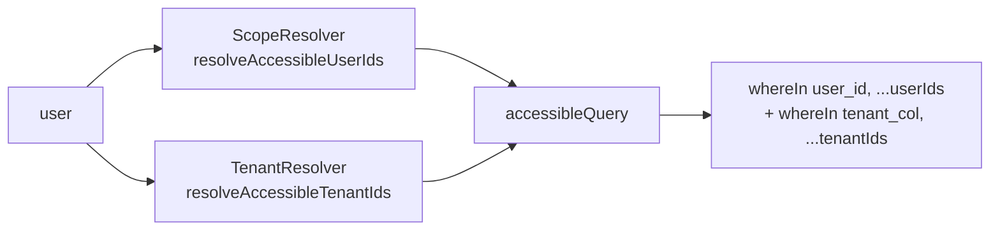
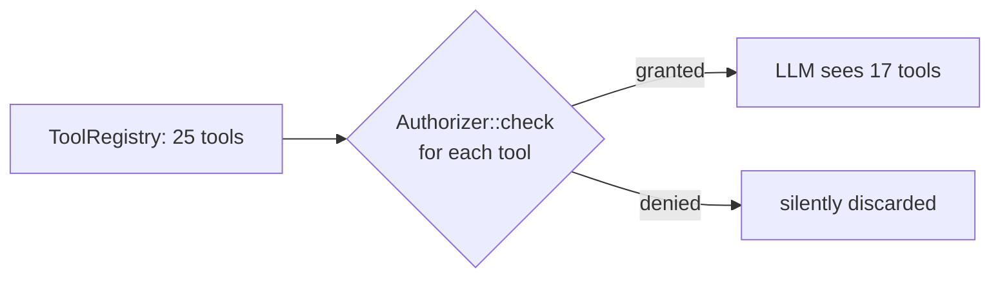

# Authorization

*English · [Español](authorization.es.md)*

> How the package decides whether a user may invoke a tool and what data they
> can see. Covers the 4-step cascade —**permission → scope → tenant → ownership**—
> and the 3 contracts the host implements: `Authorizer`, `ScopeResolver`,
> `TenantResolver`.
>
> Pre-reading: §1 of [`getting-started.md`](getting-started.md) (installation).

---

## 1. Authorization cascade

Before invoking `handle()` on any tool, `BaseBackendTool::execute()`
runs through four filters in strict order. If **any** step fails, the tool
returns a `ToolResult::error(...)` and `handle()` is **not invoked**.

```mermaid
flowchart TD
    A[ChatService receives tool_call] --> B{1 · valid args?<br/>JSON Schema → Validator}
    B -->|no| BX[error: validation]
    B -->|yes| C{2 · permission?<br/>Authorizer::check}
    C -->|no| CX[error: unauthorized]
    C -->|yes| D{3 · tenantScope=true?}
    D -->|no| F[handle args, ctx]
    D -->|yes| E{4 · TenantResolver<br/>resolves != []?}
    E -->|[]| EX[error: out_of_scope]
    E -->|null or list| F
    F --> G{5 · accessibleQuery?<br/>whereIn user/tenant}
    G --> H[handle runs filtered<br/>query]
    H --> I[ToolResult::success]
```

| # | Step | Where | Fails with |
|---|---|---|---|
| 1 | Validate args | `BaseBackendTool::execute()` | `error('validation', …)` |
| 2 | Permission | `Authorizer::check($user, $tool->permissions())` | `error('unauthorized', …)` |
| 3 | Tenant scope | `TenantResolver::resolveAccessibleTenantIds(...)` | `error('out_of_scope', …)` |
| 4 | Data scope | `ScopeResolver::resolveAccessibleUserIds(...)` applied in `accessibleQuery()` | tool returns `[]` or your policy decides |
| 5 | Pointwise ownership | your `handle()` with `accessibleQuery()->where('id', …)` | `error('not_owner', …)` |

> Steps 1–3 are automatic. Steps 4–5 are expressed by you inside `handle()`
> using the `$this->accessibleQuery(…)` helper.

---

## 2. `Authorizer` — step 1 (permission)

Decides whether a user holds **ALL** permissions declared by
`$tool->permissions()` (AND rule). Empty list = "public tool" = `true`.

### 2.1 Built-in implementations

| Implementation | Activation | How it checks |
|---|---|---|
| `SpatieAuthorizer` | `chatbot.authorization.resolver = 'spatie'` (default when Spatie is installed) | `$user->can($permission)` per permission, AND with short-circuit. |
| `GateAuthorizer` | `chatbot.authorization.resolver = 'gate'` (fallback) | `Gate::forUser($user)->allows($permission)` per permission. |
| Custom | `chatbot.authorization.authorizer = MyAuthorizer::class` | Your class. |

### 2.2 Spatie + ownership: step-by-step recipe

> **Case 1**: regular employee sees only their own invoices; manager sees their
> team's; admin sees all.

**Step 1.** Model permissions and roles (`database/seeders/PermissionSeeder.php`):

```php
$view = Permission::firstOrCreate(['name' => 'invoices.view']);
$update = Permission::firstOrCreate(['name' => 'invoices.update']);

$employee = Role::firstOrCreate(['name' => 'employee'])->givePermissionTo($view);
$manager  = Role::firstOrCreate(['name' => 'manager'])->givePermissionTo([$view, $update]);
$admin    = Role::firstOrCreate(['name' => 'admin'])->givePermissionTo(Permission::all());
```

**Step 2.** Declare the permission on the tool:

```php
public function permissions(): array { return ['invoices.view']; }
```

**Step 3.** Declare the **default** scope:

```php
public function defaultScope(): AccessScope { return AccessScope::Self; }
```

**Step 4.** Allow role-based overrides (optional). The bot receives the scope
chosen by the host based on the user's role, rather than relying on `defaultScope()`:

```php
// app/Chatbot/Tools/ListInvoicesTool.php
public function defaultScope(): AccessScope
{
    $user = auth()->user();

    if ($user->hasRole('admin'))   return AccessScope::All;
    if ($user->hasRole('manager')) return AccessScope::Team;

    return AccessScope::Self;
}
```

> **Why inside the tool and not in the ScopeResolver**: the `ScopeResolver`
> maps `AccessScope` → `[user_id, …]`. The choice of *AccessScope* based on
> role/context belongs to the tool's author. Keeping the scope decision in the
> tool leaves the `ScopeResolver` purely declarative.

**Step 5.** In `handle()`, pass the scope to the `accessibleQuery()` helper. The
helper reads `defaultScope()` automatically:

```php
public function handle(array $args, ToolContext $ctx): ToolResult
{
    $invoices = $this->accessibleQuery(Invoice::query(), $ctx)
        ->when($args['status'] ?? null, fn ($q, $s) => $q->where('status', $s))
        ->limit(20)
        ->get();

    return ToolResult::success(['items' => $invoices->toArray()]);
}
```

`accessibleQuery()` applies `whereIn('user_id', $accessibleIds)` where
`$accessibleIds` comes from the `ScopeResolver`. If your model uses a different
column name:

```php
class ListInvoicesTool extends BaseBackendTool
{
    protected string $ownerColumn = 'created_by_id'; // default: 'user_id'
    // …
}
```

### 2.3 Custom Authorizer

If your host has a proprietary permission system:

```php
namespace App\Chatbot\Authorization;

use Illuminate\Contracts\Auth\Authenticatable;
use Rnkr69\LaraChatbot\Authorization\Contracts\Authorizer;

class CustomAuthorizer implements Authorizer
{
    public function check(Authenticatable $user, array $permissions): bool
    {
        if ($permissions === []) return true; // public tool

        return collect($permissions)->every(
            fn ($perm) => $this->companyAcl->isGranted($user, $perm),
        );
    }
}
```

```php
// config/chatbot.php
'authorization' => [
    'resolver'   => 'custom',
    'authorizer' => \App\Chatbot\Authorization\CustomAuthorizer::class,
],
```

---

## 3. `ScopeResolver` — step 4 (data scope)

Maps `AccessScope` → a list of user IDs whose rows the caller may see.

### 3.1 Default `NullScopeResolver`

The package binds a `NullScopeResolver` by default:

| Scope | Behaviour |
|---|---|
| `Self` | returns `[user.id]` |
| `Team` | throws `ScopeResolverNotConfiguredException` |
| `All` | throws `ScopeResolverNotConfiguredException` |

**"Fail loudly" policy**: if a host tool declares `defaultScope=Team` but the
host has not implemented a resolver, the first LLM turn throws with a clear
message ("ScopeResolver not configured for Team") instead of silently returning
empty data.

### 3.2 Host implementation: recipe

`chatbot:install` generates a stub at `app/Chatbot/Authorization/AppScopeResolver.php`:

```php
namespace App\Chatbot\Authorization;

use App\Models\User;
use Illuminate\Contracts\Auth\Authenticatable;
use Rnkr69\LaraChatbot\Authorization\AccessScope;
use Rnkr69\LaraChatbot\Authorization\Contracts\ScopeResolver;

class AppScopeResolver implements ScopeResolver
{
    public function resolveAccessibleUserIds(Authenticatable $user, AccessScope $scope): array
    {
        return match ($scope) {
            AccessScope::Self => [$user->getAuthIdentifier()],
            AccessScope::Team => $this->teamMemberIds($user),
            AccessScope::All  => User::query()->pluck('id')->all(),
        };
    }

    private function teamMemberIds(Authenticatable $user): array
    {
        // "manager → team" pattern: the manager sees their reports + themselves.
        return $user->reports()->pluck('id')->prepend($user->getAuthIdentifier())->all();
    }
}
```

Register it:

```php
// config/chatbot.php
'authorization' => [
    'scope_resolver' => \App\Chatbot\Authorization\AppScopeResolver::class,
],
```

### 3.3 "Manager → team" pattern step by step

**Domain model** (assuming a `users` table with a self-referencing FK
`manager_id`):

```php
// app/Models/User.php
public function manager() { return $this->belongsTo(User::class, 'manager_id'); }

public function reports() { return $this->hasMany(User::class, 'manager_id'); }

/** Recursive: direct + indirect subordinates. */
public function reportsTree()
{
    return User::query()
        ->whereDescendantOf($this) // if using nested set / closure table
        ->orWhere('id', $this->id);
}
```

**ScopeResolver with recursive hierarchy**:

```php
private function teamMemberIds(Authenticatable $user): array
{
    return User::query()
        ->whereIn('manager_id', $user->reports()->pluck('id')) // 2nd level
        ->orWhere('manager_id', $user->getAuthIdentifier())    // 1st level
        ->orWhere('id', $user->getAuthIdentifier())            // self
        ->pluck('id')
        ->all();
}
```

> **Performance**: for large trees (>100 nodes), consider materialising the
> hierarchy in a `team_members` table or caching it in Redis. The resolver is
> called on **every tool call**; an uncached `O(depth × N)` recursion can
> dominate the turn's wall-clock time.

### 3.4 Tooling to discover bugs

```bash
# List all registered tools and their default scope
php artisan chatbot:tools:list
```

If a tool with `defaultScope=Team` appears but your `AppScopeResolver` does not
implement `Team` correctly, on the first LLM turn you will see:

```
Rnkr69\LaraChatbot\Authorization\Exceptions\ScopeResolverNotConfiguredException:
  ScopeResolver no soporta el scope Team. Implementa AppScopeResolver::resolveTeam.
```

---

## 4. `TenantResolver` — step 3 (cross-host gap)

> **Background**: multi-tenant hosts (`corporation_id`) and entity-scoped
> hosts (`event_id`). A 4th dimension when `permission/scope/ownership` are
> not sufficient.

Maps `(user, tool, pageContext)` → accessible tenant IDs.

| Return value | Meaning | Effect in `accessibleQuery()` |
|---|---|---|
| `null` | caller has access to ALL tenants | no `whereIn` by tenant is applied |
| `[]` | caller has access to NONE | cascade short-circuits with `out_of_scope` before `handle()` |
| `[id1, id2, …]` | access restricted to those tenants | `whereIn(tenant_column, $ids)` |

### 4.1 When to declare `tenantScope=true`

A host tool must declare it when it reads/writes a table with a tenant column
**and** tenants are sub-sets of the organisation (not everyone sees everyone):

```php
class ListEventAttendeesTool extends BaseBackendTool
{
    public function tenantScope(): bool { return true; }

    public function handle(array $args, ToolContext $ctx): ToolResult
    {
        $rows = $this->accessibleQuery(
            Attendee::query(),
            $ctx,
            tenantColumn: 'event_id',
        )->get();

        return ToolResult::success(['items' => $rows->toArray()]);
    }
}
```

### 4.2 Example TenantResolver

```php
namespace App\Chatbot\Authorization;

use Illuminate\Contracts\Auth\Authenticatable;
use Rnkr69\LaraChatbot\Authorization\Contracts\TenantResolver;
use Rnkr69\LaraChatbot\Tools\Contracts\BackendTool;

class CorporationTenantResolver implements TenantResolver
{
    public function resolveAccessibleTenantIds(
        Authenticatable $user,
        BackendTool $tool,
        array $pageContext,
    ): ?array {
        // 1) Global admin: no filter.
        if ($user->hasRole('global_admin')) {
            return null;
        }

        // 2) If page context contains a selected corporation, filter to it.
        if ($selected = $pageContext['corporation_id'] ?? null) {
            $allowed = $user->corporations()->pluck('id')->all();
            return in_array($selected, $allowed, strict: true) ? [$selected] : [];
        }

        // 3) General case: all corporations the user belongs to.
        return $user->corporations()->pluck('id')->all();
    }
}
```

```php
// config/chatbot.php
'authorization' => [
    'tenant_resolver' => \App\Chatbot\Authorization\CorporationTenantResolver::class,
],
```

### 4.3 Fail-fast at boot

If a registered tool declares `tenantScope=true` but
`chatbot.authorization.tenant_resolver` is `null`, `ToolRegistry` throws:

```
Rnkr69\LaraChatbot\Tools\Exceptions\MissingTenantResolverException:
  La tool 'list_event_attendees' declara tenantScope=true pero no hay
  TenantResolver registrado en chatbot.authorization.tenant_resolver.
```

This happens at provider **boot** (`php artisan serve` will not start), not at
runtime. "Fail loudly" policy.

### 4.4 Combining tenant + scope



Both filters are applied with AND. A manager with scope=Team who belongs to
corporations [1,3] will see `WHERE user_id IN (123, 124, 125) AND corporation_id IN (1, 3)`.

---

## 5. Pointwise ownership — step 5

`accessibleQuery()` filters broadly by user+tenant. To verify ownership of a
**specific** record (`target_id` arriving from the LLM), the canonical pattern
is:

```php
public function handle(array $args, ToolContext $ctx): ToolResult
{
    $invoice = $this->accessibleQuery(Invoice::query(), $ctx)
        ->where('id', $args['target_id'])
        ->first();

    if (! $invoice) {
        return ToolResult::error('not_owner', 'Factura no encontrada o no accesible.');
    }

    $invoice->markAsPaid();

    return ToolResult::success(['invoice' => $invoice->fresh()->toArray()]);
}
```

> **Never** do `Invoice::find($args['target_id'])`. Bypassing
> `accessibleQuery()` disables the cascade and allows reading/mutating records
> that belong to others. `Authorizer::check` has already passed, but that step
> does **not** validate pointwise ownership — it only checks "can invoke the
> tool in the abstract".

If your host already has Laravel policies:

```php
if (! $ctx->user->can('update', $invoice)) {
    return ToolResult::error('unauthorized', 'No tienes permiso de update.');
}
```

Combining `accessibleQuery` + `Gate::authorize` is safe by construction —
the first step filters by scope/tenant; the second applies policy rules that
don't fit in a `whereIn` (e.g. "only if the invoice is not closed").

---

## 6. Catalogue filtering

Before passing the tool catalogue to the LLM, `ChatService::resolveTools()`
filters out tools for which `Authorizer::check($user, $tool->permissions())`
returns `false`.

**Implication**: the LLM never sees a tool the user cannot invoke, and
therefore will never suggest it.



This filtering does **not** replace the authorization cascade: if a tool were
incorrectly passed through and a `tool_call` still arrives (unlikely but
defensive), `BaseBackendTool::execute()` will cut it with `unauthorized`.

---

## 7. Audit events

After every invocation (including `unauthorized`/`out_of_scope` errors), the
orchestrator emits `Rnkr69\LaraChatbot\Events\ToolInvoked`. Listen to it from
`AppServiceProvider::boot()`:

```php
Event::listen(\Rnkr69\LaraChatbot\Events\ToolInvoked::class, function ($event) {
    Log::channel('audit')->info('chatbot.tool', [
        'user_id'    => $event->user->getAuthIdentifier(),
        'tool'       => $event->tool->name(),
        'permission' => $event->tool->permissions(),
        'scope'      => $event->tool->defaultScope()->value,
        'tenants'    => $event->tool->tenantScope() ? 'yes' : 'no',
        'result'     => $event->result->isOk() ? 'ok' : $event->result->code,
        'duration'   => $event->durationMs,
    ]);
});
```

> For scenarios with sensitive data, redact `args` before logging.
> The package does not apply automatic redaction.

---

## 8. Security review checklist

- [ ] Every tool declares a non-empty `permissions()` if it has side effects.
- [ ] `Authorizer` correctly configured (`spatie`/`gate`/custom),
      verifiable with `chatbot:test-connection` + a user message that triggers
      a tool.
- [ ] `ScopeResolver` implements `Self`/`Team`/`All` (or throws if your app
      does not use one of the scopes — intentionally, not by omission).
- [ ] Tools that touch tables with a tenant column declare `tenantScope=true`
      and pass `tenantColumn:` to `accessibleQuery()`.
- [ ] `TenantResolver` registered in `config/chatbot.php` if **at least one**
      tool declares `tenantScope=true`.
- [ ] Tools with a `target_id` validate ownership with
      `accessibleQuery()->where('id', …)->first()` before mutating.
- [ ] `ToolInvoked` listener registered for auditing.
- [ ] Tests covering: user without permission, user with permission but empty
      scope, foreign ownership (different user / tenant). See
      [`testing.md`](testing.md) for patterns.

---

## 9. References

- Contracts: `src/Authorization/Contracts/{Authorizer,ScopeResolver,TenantResolver}.php`.
- Default implementations: `src/Authorization/{SpatieAuthorizer,GateAuthorizer,NullScopeResolver}.php`.
- Trait that applies the cascade: `src/Authorization/Concerns/AuthorizesToolAccess.php`.
- Exceptions: `src/Authorization/Exceptions/{ScopeResolverNotConfiguredException,ToolUnauthorizedException}.php`.
- `BackendTool` contract doc: [`backend-tools.md`](backend-tools.md).
