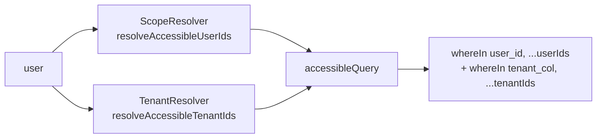
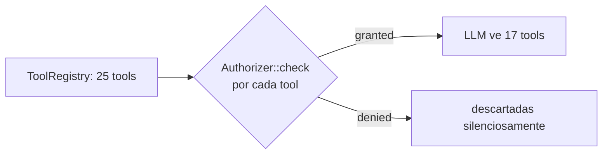

# Authorization

> Cómo el paquete decide si un usuario puede invocar una tool y qué datos puede
> ver. Cubre la cascada de 4 pasos —**permission → scope → tenant → ownership**—
> y los 3 contratos que el host implementa: `Authorizer`, `ScopeResolver`,
> `TenantResolver`.
>
> Pre-lectura: §1 del `getting-started.md` (instalación) + §2 del `ROADMAP.md`
> (modelo conceptual).

---

## 1. Cascada de autorización

Antes de invocar `handle()` de cualquier tool, `BaseBackendTool::execute()`
recorre cuatro filtros en orden estricto. Si **cualquier** paso falla, la tool
devuelve un `ToolResult::error(...)` y `handle()` **no se invoca**.

```mermaid
flowchart TD
    A[ChatService recibe tool_call] --> B{1 · args válidos?<br/>JSON Schema → Validator}
    B -->|no| BX[error: validation]
    B -->|sí| C{2 · permission?<br/>Authorizer::check}
    C -->|no| CX[error: unauthorized]
    C -->|sí| D{3 · tenantScope=true?}
    D -->|no| F[handle args, ctx]
    D -->|sí| E{4 · TenantResolver<br/>resuelve != []?}
    E -->|[]| EX[error: out_of_scope]
    E -->|null o lista| F
    F --> G{5 · accessibleQuery?<br/>whereIn user/tenant}
    G --> H[handle ejecuta query<br/>filtrada]
    H --> I[ToolResult::success]
```

| # | Paso | Donde | Falla con |
|---|---|---|---|
| 1 | Validar args | `BaseBackendTool::execute()` | `error('validation', …)` |
| 2 | Permission | `Authorizer::check($user, $tool->permissions())` | `error('unauthorized', …)` |
| 3 | Tenant scope | `TenantResolver::resolveAccessibleTenantIds(...)` | `error('out_of_scope', …)` |
| 4 | Scope de datos | `ScopeResolver::resolveAccessibleUserIds(...)` aplicado en `accessibleQuery()` | tool devuelve `[]` o tu policy decide |
| 5 | Ownership puntual | tu `handle()` con `accessibleQuery()->where('id', …)` | `error('not_owner', …)` |

> Pasos 1-3 son automáticos. Pasos 4-5 los expresas tú dentro de `handle()`
> usando el helper `$this->accessibleQuery(…)`.

---

## 2. `Authorizer` — paso 1 (permission)

Decide si un usuario tiene **TODOS** los permisos declarados por
`$tool->permissions()` (regla AND). Lista vacía = "tool pública" = `true`.

### 2.1 Implementaciones del paquete

| Implementación | Activación | Cómo verifica |
|---|---|---|
| `SpatieAuthorizer` | `chatbot.authorization.resolver = 'spatie'` (default si Spatie está instalado) | `$user->can($permission)` por cada permiso, AND con short-circuit. |
| `GateAuthorizer` | `chatbot.authorization.resolver = 'gate'` (fallback) | `Gate::forUser($user)->allows($permission)` por cada permiso. |
| Custom | `chatbot.authorization.authorizer = MyAuthorizer::class` | Tu clase. |

### 2.2 Spatie + ownership: receta paso a paso

> **Caso 1**: empleado regular ve sólo sus facturas; manager ve las de su
> equipo; admin ve todas.

**Paso 1.** Modelar permisos y roles (`database/seeders/PermissionSeeder.php`):

```php
$view = Permission::firstOrCreate(['name' => 'invoices.view']);
$update = Permission::firstOrCreate(['name' => 'invoices.update']);

$employee = Role::firstOrCreate(['name' => 'employee'])->givePermissionTo($view);
$manager  = Role::firstOrCreate(['name' => 'manager'])->givePermissionTo([$view, $update]);
$admin    = Role::firstOrCreate(['name' => 'admin'])->givePermissionTo(Permission::all());
```

**Paso 2.** Declarar el permiso en la tool:

```php
public function permissions(): array { return ['invoices.view']; }
```

**Paso 3.** Declarar el scope **default**:

```php
public function defaultScope(): AccessScope { return AccessScope::Self; }
```

**Paso 4.** Permitir overrides por rol (opcional). El bot recibe el scope que
elige el host basándose en el rol del usuario, no fijándose en `defaultScope()`:

```php
// app/Chatbot/Tools/ListInvoicesTool.php
public function defaultScope(): AccessScope
{
    $user = auth()->user();

    if ($user->hasRole('admin'))   return AccessScope::All;
    if ($user->hasRole('manager')) return AccessScope::Team;

    return AccessScope::Self;
}
```

> **Por qué dentro de la tool y no en el ScopeResolver**: el `ScopeResolver`
> mapea `AccessScope` → `[user_id, …]`. La elección del *AccessScope* en
> función del rol/contexto es del que define la tool. Mantener la decisión
> del scope en la tool deja al `ScopeResolver` puramente declarativo.

**Paso 5.** En `handle()`, pasa el scope al helper `accessibleQuery()`. El helper
lee `defaultScope()` automáticamente:

```php
public function handle(array $args, ToolContext $ctx): ToolResult
{
    $invoices = $this->accessibleQuery(Invoice::query(), $ctx)
        ->when($args['status'] ?? null, fn ($q, $s) => $q->where('status', $s))
        ->limit(20)
        ->get();

    return ToolResult::success(['items' => $invoices->toArray()]);
}
```

`accessibleQuery()` aplica `whereIn('user_id', $accessibleIds)` donde
`$accessibleIds` viene del `ScopeResolver`. Si tu modelo usa otro nombre de
columna:

```php
class ListInvoicesTool extends BaseBackendTool
{
    protected string $ownerColumn = 'created_by_id'; // por defecto: 'user_id'
    // …
}
```

### 2.3 Authorizer custom

Si tu host tiene un sistema propietario:

```php
namespace App\Chatbot\Authorization;

use Illuminate\Contracts\Auth\Authenticatable;
use Rnkr69\LaraChatbot\Authorization\Contracts\Authorizer;

class CustomAuthorizer implements Authorizer
{
    public function check(Authenticatable $user, array $permissions): bool
    {
        if ($permissions === []) return true; // tool pública

        return collect($permissions)->every(
            fn ($perm) => $this->companyAcl->isGranted($user, $perm),
        );
    }
}
```

```php
// config/chatbot.php
'authorization' => [
    'resolver'   => 'custom',
    'authorizer' => \App\Chatbot\Authorization\CustomAuthorizer::class,
],
```

---

## 3. `ScopeResolver` — paso 4 (scope de datos)

Mapea `AccessScope` → lista de IDs de usuario cuyas filas el invocador puede
ver.

### 3.1 Default `NullScopeResolver`

El paquete bind por defecto un `NullScopeResolver`:

| Scope | Comportamiento |
|---|---|
| `Self` | devuelve `[user.id]` |
| `Team` | lanza `ScopeResolverNotConfiguredException` |
| `All` | lanza `ScopeResolverNotConfiguredException` |

**Política "falla ruidosamente"**: si una tool del host declara
`defaultScope=Team` pero el host no implementa el resolver, el primer turno del
LLM revienta con un mensaje claro ("ScopeResolver no configurado para Team")
en lugar de devolver datos vacíos silenciosamente.

### 3.2 Implementación host: receta

`chatbot:install` genera un stub en `app/Chatbot/Authorization/AppScopeResolver.php`:

```php
namespace App\Chatbot\Authorization;

use App\Models\User;
use Illuminate\Contracts\Auth\Authenticatable;
use Rnkr69\LaraChatbot\Authorization\AccessScope;
use Rnkr69\LaraChatbot\Authorization\Contracts\ScopeResolver;

class AppScopeResolver implements ScopeResolver
{
    public function resolveAccessibleUserIds(Authenticatable $user, AccessScope $scope): array
    {
        return match ($scope) {
            AccessScope::Self => [$user->getAuthIdentifier()],
            AccessScope::Team => $this->teamMemberIds($user),
            AccessScope::All  => User::query()->pluck('id')->all(),
        };
    }

    private function teamMemberIds(Authenticatable $user): array
    {
        // Patrón "manager → equipo": el manager ve a los suyos + a sí mismo.
        return $user->reports()->pluck('id')->prepend($user->getAuthIdentifier())->all();
    }
}
```

Y se registra:

```php
// config/chatbot.php
'authorization' => [
    'scope_resolver' => \App\Chatbot\Authorization\AppScopeResolver::class,
],
```

### 3.3 Patrón "manager → equipo" paso a paso

**Modelo de dominio** (asumiendo tabla `users` con columna self-FK
`manager_id`):

```php
// app/Models/User.php
public function manager() { return $this->belongsTo(User::class, 'manager_id'); }

public function reports() { return $this->hasMany(User::class, 'manager_id'); }

/** Recursivo: subordinados directos + indirectos. */
public function reportsTree()
{
    return User::query()
        ->whereDescendantOf($this) // si usas nested set / closure table
        ->orWhere('id', $this->id);
}
```

**ScopeResolver con jerarquía recursiva**:

```php
private function teamMemberIds(Authenticatable $user): array
{
    return User::query()
        ->whereIn('manager_id', $user->reports()->pluck('id')) // 2º nivel
        ->orWhere('manager_id', $user->getAuthIdentifier())    // 1er nivel
        ->orWhere('id', $user->getAuthIdentifier())            // self
        ->pluck('id')
        ->all();
}
```

> **Performance**: para árboles grandes (>100 nodos), considera materializar
> la jerarquía en una tabla `team_members` o cachear en Redis. El resolver se
> invoca en **cada tool call**; un `O(profundidad × N)` recursivo sin caché
> puede dominar el wall-clock del turno.

### 3.4 Tooling para descubrir bugs

```bash
# Lista todas las tools registradas y su scope default
php artisan chatbot:tools:list
```

Si una tool con `defaultScope=Team` aparece pero tu `AppScopeResolver` no
implementa `Team` correctamente, en el primer turno del LLM verás:

```
Rnkr69\LaraChatbot\Authorization\Exceptions\ScopeResolverNotConfiguredException:
  ScopeResolver no soporta el scope Team. Implementa AppScopeResolver::resolveTeam.
```

---

## 4. `TenantResolver` — paso 3 (gap cross-host)

> **Origen**: hosts multi-tenant (`corporation_id`) y entity-scoped
> (`event_id`). 4ª dimensión cuando `permission/scope/ownership` no son
> suficientes.

Mapea `(usuario, tool, pageContext)` → IDs de tenant accesibles.

| Retorno | Significado | Efecto en `accessibleQuery()` |
|---|---|---|
| `null` | invocador tiene acceso a TODOS los tenants | NO se aplica `whereIn` por tenant |
| `[]` | invocador no tiene acceso a NINGUNO | la cascada corta con `out_of_scope` antes de `handle()` |
| `[id1, id2, …]` | acceso restringido a esos tenants | `whereIn(tenant_column, $ids)` |

### 4.1 Cuándo declarar `tenantScope=true`

Una tool de tu host debe declararlo cuando lee/escribe sobre una tabla con
columna de tenant **y** los tenants son sub-conjuntos de la organización (no
todo el mundo ve todos):

```php
class ListEventAttendeesTool extends BaseBackendTool
{
    public function tenantScope(): bool { return true; }

    public function handle(array $args, ToolContext $ctx): ToolResult
    {
        $rows = $this->accessibleQuery(
            Attendee::query(),
            $ctx,
            tenantColumn: 'event_id',
        )->get();

        return ToolResult::success(['items' => $rows->toArray()]);
    }
}
```

### 4.2 TenantResolver de ejemplo

```php
namespace App\Chatbot\Authorization;

use Illuminate\Contracts\Auth\Authenticatable;
use Rnkr69\LaraChatbot\Authorization\Contracts\TenantResolver;
use Rnkr69\LaraChatbot\Tools\Contracts\BackendTool;

class CorporationTenantResolver implements TenantResolver
{
    public function resolveAccessibleTenantIds(
        Authenticatable $user,
        BackendTool $tool,
        array $pageContext,
    ): ?array {
        // 1) Admin global: ningún filtro.
        if ($user->hasRole('global_admin')) {
            return null;
        }

        // 2) Si el page context tiene una corporación seleccionada, filtra a esa.
        if ($selected = $pageContext['corporation_id'] ?? null) {
            $allowed = $user->corporations()->pluck('id')->all();
            return in_array($selected, $allowed, strict: true) ? [$selected] : [];
        }

        // 3) Caso general: todas las corporaciones del usuario.
        return $user->corporations()->pluck('id')->all();
    }
}
```

```php
// config/chatbot.php
'authorization' => [
    'tenant_resolver' => \App\Chatbot\Authorization\CorporationTenantResolver::class,
],
```

### 4.3 Fail-fast al boot

Si una tool registrada declara `tenantScope=true` pero `chatbot.authorization.tenant_resolver`
es `null`, el `ToolRegistry` lanza:

```
Rnkr69\LaraChatbot\Tools\Exceptions\MissingTenantResolverException:
  La tool 'list_event_attendees' declara tenantScope=true pero no hay
  TenantResolver registrado en chatbot.authorization.tenant_resolver.
```

Esto sucede en el **boot** del provider (`php artisan serve` no arranca), no
en runtime. Política "falla ruidosamente".

### 4.4 Combinar tenant + scope



Ambos filtros se aplican en AND. Un manager con scope=Team que pertenece a las
corporaciones [1,3] verá `WHERE user_id IN (123, 124, 125) AND corporation_id IN (1, 3)`.

---

## 5. Ownership puntual — paso 5

`accessibleQuery()` filtra masivamente por usuario+tenant. Para verificar
ownership de un registro **concreto** (`target_id` que llega del LLM), el
patrón canónico es:

```php
public function handle(array $args, ToolContext $ctx): ToolResult
{
    $invoice = $this->accessibleQuery(Invoice::query(), $ctx)
        ->where('id', $args['target_id'])
        ->first();

    if (! $invoice) {
        return ToolResult::error('not_owner', 'Factura no encontrada o no accesible.');
    }

    $invoice->markAsPaid();

    return ToolResult::success(['invoice' => $invoice->fresh()->toArray()]);
}
```

> **Nunca** hagas `Invoice::find($args['target_id'])`. Saltarte
> `accessibleQuery()` deshabilita la cascada y permite leer/mutar registros
> ajenos. El `Authorizer::check` ha pasado, pero ese paso **no** valida
> ownership puntual — sólo "puede invocar la tool en abstracto".

Si tu host tiene policies Laravel ya escritas:

```php
if (! $ctx->user->can('update', $invoice)) {
    return ToolResult::error('unauthorized', 'No tienes permiso de update.');
}
```

Combinar `accessibleQuery` + `Gate::authorize` es seguro por construcción —
el primer paso filtra por scope/tenant; el segundo aplica reglas de policy
que no encajan en `whereIn` (e.g. "sólo si la factura no está cerrada").

---

## 6. Filtrado del catálogo

Antes de pasar el catálogo de tools al LLM, `ChatService::resolveTools()` filtra
las tools cuyo `Authorizer::check($user, $tool->permissions())` devuelve `false`.

**Implicación**: el LLM nunca ve una tool que el usuario no puede invocar.
Por tanto, no la sugerirá.



Este filtrado **no** sustituye la cascada de autorización: si una tool fue
filtrada por error y aun así llega un `tool_call` (improbable pero defensivo),
`BaseBackendTool::execute()` la corta con `unauthorized`.

---

## 7. Eventos de auditoría

Tras cada invocación (incluyendo errores `unauthorized`/`out_of_scope`), el
orquestador emite `Rnkr69\LaraChatbot\Events\ToolInvoked`. Engánchalo desde
`AppServiceProvider::boot()`:

```php
Event::listen(\Rnkr69\LaraChatbot\Events\ToolInvoked::class, function ($event) {
    Log::channel('audit')->info('chatbot.tool', [
        'user_id'    => $event->user->getAuthIdentifier(),
        'tool'       => $event->tool->name(),
        'permission' => $event->tool->permissions(),
        'scope'      => $event->tool->defaultScope()->value,
        'tenants'    => $event->tool->tenantScope() ? 'yes' : 'no',
        'result'     => $event->result->isOk() ? 'ok' : $event->result->code,
        'duration'   => $event->durationMs,
    ]);
});
```

> Para escenarios con datos sensibles, redacta los `args` antes de loguear.
> El paquete no aplica redaction automática.

---

## 8. Checklist de revisión de seguridad

- [ ] Cada tool declara `permissions()` no-vacía si tiene efectos.
- [ ] `Authorizer` configurado correctamente (`spatie`/`gate`/custom),
      verificable con `chatbot:test-connection` + un mensaje del usuario que
      dispare una tool.
- [ ] `ScopeResolver` implementa `Self`/`Team`/`All` (o lanza si tu app no usa
      uno de los scopes — conscientemente, no por olvido).
- [ ] Tools que tocan tablas con columna tenant declaran `tenantScope=true`
      y pasan `tenantColumn:` al `accessibleQuery()`.
- [ ] `TenantResolver` registrado en `config/chatbot.php` si **al menos una**
      tool declara `tenantScope=true`.
- [ ] Tools con `target_id` validan ownership con
      `accessibleQuery()->where('id', …)->first()` antes de mutar.
- [ ] Listener de `ToolInvoked` registrado para auditoría.
- [ ] Tests cubriendo: usuario sin permiso, usuario con permiso pero scope
      vacío, ownership ajeno (otro user / tenant). Ver
      [`testing.md`](testing.md) para patrones.

---

## 9. Referencias

- Contratos: `src/Authorization/Contracts/{Authorizer,ScopeResolver,TenantResolver}.php`.
- Implementaciones default: `src/Authorization/{SpatieAuthorizer,GateAuthorizer,NullScopeResolver}.php`.
- Trait que aplica la cascada: `src/Authorization/Concerns/AuthorizesToolAccess.php`.
- Excepciones: `src/Authorization/Exceptions/{ScopeResolverNotConfiguredException,ToolUnauthorizedException}.php`.
- Doc del contrato `BackendTool`: [`backend-tools.md`](backend-tools.md).
- Decisión de diseño: ROADMAP §2.4 + PROJECT_DEFINITION §8.2.
