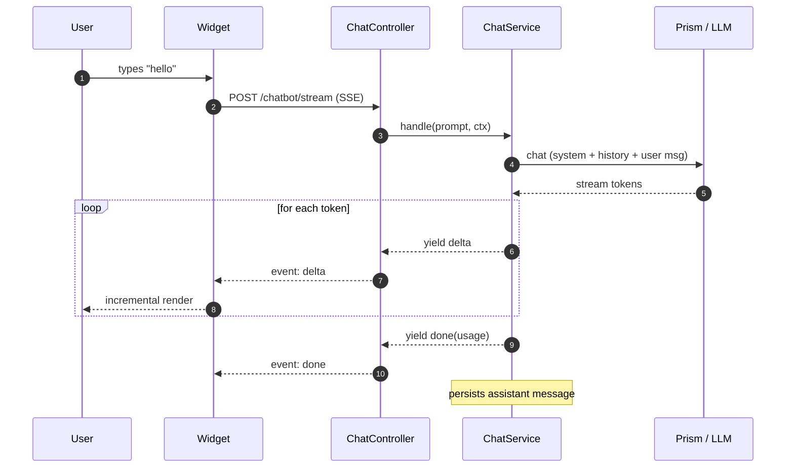
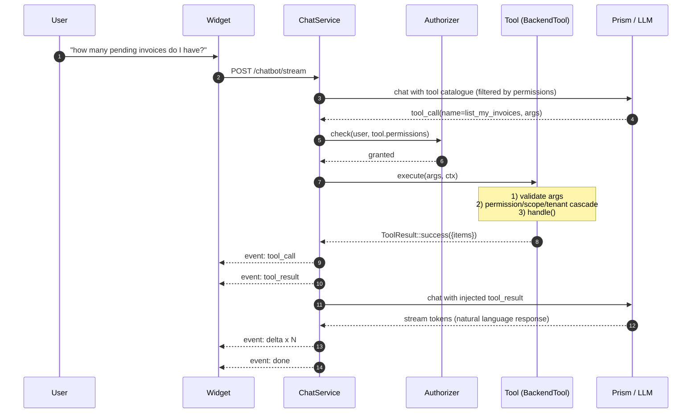
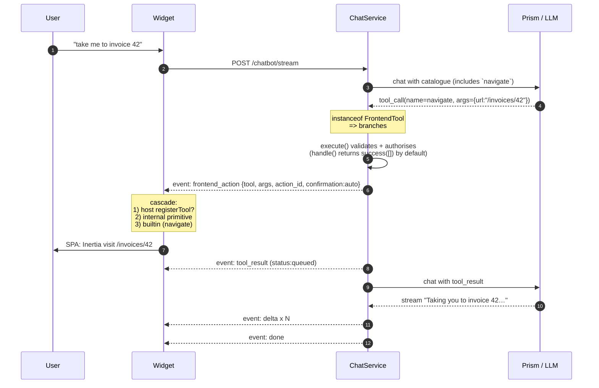
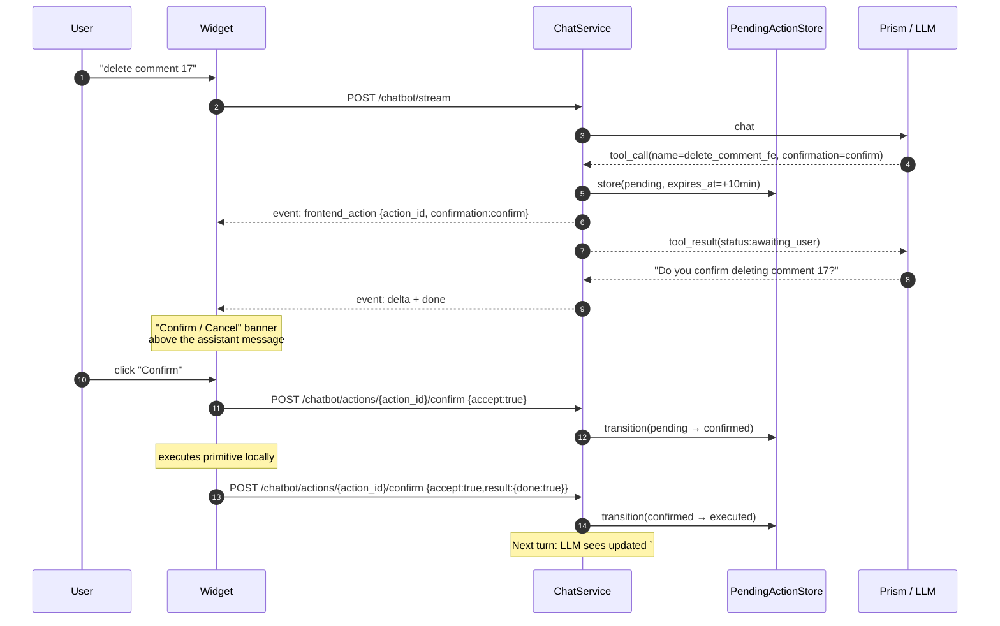

# Getting Started

*English · [Español](getting-started.es.md)*

> End-to-end integrator guide. If you are a developer on a Laravel project and need
> to get `rnkr69/lara-chatbot` running in an afternoon without asking for help,
> this is your place.
>
> Prerequisites are covered in [Requirements](#1-requirements). If you have already
> run `composer require rnkr69/lara-chatbot` and `chatbot:install`, jump to
> [Hello world](#3-hello-world-your-first-conversation) or
> [First tool end-to-end](#5-first-tool-end-to-end).

---

## 1. Requirements

| Component | Version | Notes |
|---|---|---|
| PHP | `^8.2` | Tested on 8.2 / 8.3 / 8.4. Requires `ext-pdo`, `ext-json`, `ext-mbstring`. |
| Laravel | `^12.0` or `^13.0` | Both tested in CI. Also `^11.0`, but with a caveat (security-EOL — see [Laravel 11](#laravel-11)). |
| Database | MySQL ≥ 8.0, PostgreSQL ≥ 13, SQLite | Any driver supported by Eloquent + JSON columns. |
| LLM provider | Anthropic / OpenAI / Groq / Gemini / Mistral / Ollama | Any provider supported by [Prism](https://github.com/prism-php/prism). |
| Node + npm | `node ≥ 20`, `npm ≥ 10` | Only if you plan to customise the widget; the precompiled bundle is published via `vendor:publish --tag=chatbot-assets`. |

**Installing.** The package is published on Packagist as
[`rnkr69/lara-chatbot`](https://packagist.org/packages/rnkr69/lara-chatbot), so a
plain `composer require` works (see §2.1). For private or self-hosted
distribution (VCS, Satis, Packeton, Private Packagist) see
[`distribution.md`](distribution.md).

**Host login route.** The package mounts `/chatbot*` behind the `auth` middleware
(`chatbot.route.middleware`). When an unauthenticated user accesses one of those
routes, Laravel's `auth` guard redirects to the **named route `login`**.
If your host does not define it — Backpack, for example, registers
`backpack.auth.login`, not `login` — the request explodes with
`RouteNotFoundException: Route [login] not defined` → **HTTP 500** instead of a
clean redirect to login. Define a `login` route, **or** configure
`redirectGuestsTo()` in `bootstrap/app.php`:

```php
->withMiddleware(function (Middleware $middleware) {
    // Point to the host's actual login route (Backpack, Filament, custom…).
    $middleware->redirectGuestsTo(fn () => route('backpack.auth.login'));
})
```

This affects any `auth` route in the host, not only the chatbot routes.

---

## 2. Quick installation

### 2.1 Install the package

```bash
composer require rnkr69/lara-chatbot
```

### Laravel 11

The package **supports** Laravel 11 (`illuminate/* ^11.0|^12.0|^13.0`), but Laravel 11
reached its **end of security support (~March 2026)**: the entire `11.x` line
carries an unpatched advisory. Recent versions of Composer block installation of
packages flagged with advisories (`audit.block-insecure`) by default, so **a clean
install on Laravel 11 fails** with an error like
`… not loaded, because they are affected by security advisories`.

Recommendation: **use Laravel 12**. If you still need to run on Laravel 11 and
accept the risk of an unpatched framework, disable the block in your host app
before installing:

```bash
# option A — Composer config of the host project
composer config audit.block-insecure false
composer require rnkr69/lara-chatbot
```

```json
// option B — in the host's composer.json
{
    "config": {
        "audit": { "block-insecure": false }
    }
}
```

This is the host's decision, not the package's: it only affects how Composer
handles advisories in your project. The package CI tests Laravel 12 and 13 for
this reason.

### 2.2 Run the wizard

```bash
php artisan chatbot:install
```

The `chatbot:install` wizard guides you through 9 idempotent steps:

1. **Publish config** (`config/chatbot.php`).
2. **Publish migrations** (3 tables: `chatbot_conversations`, `chatbot_messages`,
   `chatbot_pending_actions`).
3. **Publish views** (`system_prompt.blade.php`, `page.blade.php`).
4. **Publish lang** (`en/`, `es/`).
5. **LLM provider + model** — choose one of the 6 presets and write the API key
   in `.env`. If the key already exists in `.env`, it is **preserved** (not overwritten).
6. **Detect Spatie** — if `spatie/laravel-permission` is installed, proposes
   `SpatieAuthorizer`; otherwise defaults to `gate`.
7. **Stub `ScopeResolver`** — generates `app/Chatbot/Authorization/AppScopeResolver.php`
   with the `Self|Team|All` pattern.
8. **Opt-in `TenantResolver`** — if your app needs a 4th isolation dimension
   (corporation, event, space…), the wizard generates the stub.
9. **Opt-in `ListMyInvoicesTool`**, **`system_prompt_addendum.blade.php`** and
   **layout injection** of the `<chatbot-widget>` snippet.

**Wizard modes:**

```bash
php artisan chatbot:install                  # interactive
php artisan chatbot:install --no-interaction # safe defaults (does not touch host code)
php artisan chatbot:install --force          # overwrites existing publishables
```

### 2.3 Migrate

```bash
php artisan migrate
```

### 2.4 Verify LLM connection

```bash
php artisan chatbot:test-connection
```

Sends a `ping` → `pong` against the configured provider. If it fails, see
[`troubleshooting.md`](troubleshooting.md).

---

## 3. Hello world: your first conversation

### 3.1 Inject the widget

If you did **not** select "layout injection" in the wizard, manually add the
snippet before `</body>` in your main layout
(`resources/views/layouts/app.blade.php`):

```blade
{{-- chatbot:widget --}}
<chatbot-widget
    data-endpoint="{{ route('chatbot.stream') }}"
    data-position="bottom-right"
    data-default-open="false">
</chatbot-widget>
<script src="{{ asset('vendor/chatbot/chatbot-widget.js') }}" defer></script>
```

> If you do not see `vendor/chatbot/chatbot-widget.js` under `public/`, run
> `php artisan vendor:publish --tag=chatbot-assets`.

#### MPA hosts and history rehydration

If your layout mounts `<chatbot-widget>` in an **MPA** app (Laravel
server-rendered, Backpack, WordPress admin, any shell that reloads the HTML on
navigation), the widget remounts on every page. For the chat history to survive
those navigations, the bundle needs to resolve the conversations endpoint.

By default it **derives** the URL from `data-endpoint` by replacing `/stream`
with `/conversations` (the canonical pattern served by the package), so the
snippet above works as-is. If your routes do not follow that pattern (custom
prefix, subdomain, remapped route name), declare the explicit attribute:

```blade
<chatbot-widget
    data-endpoint="{{ route('chatbot.stream') }}"
    data-conversations-endpoint="{{ route('chatbot.conversations.index') }}"
    data-position="bottom-right"
    data-default-open="false">
</chatbot-widget>
```

When the explicit attribute is present it always wins over the derived URL. See
[`WIDGET.md`](WIDGET.md) for the full attribute reference.

#### Syncing light/dark mode with the host toggle

If your admin has a light/dark selector (Backpack-Tabler, standalone Tabler,
AdminLTE, Filament — any shell that writes `<html data-bs-theme>`) and you want
the widget to follow the rest of the chrome, add `data-theme="auto"`:

```blade
<chatbot-widget
    data-endpoint="{{ route('chatbot.stream') }}"
    data-position="bottom-right"
    data-theme="auto"
    data-default-open="false">
</chatbot-widget>
```

In `auto` mode (default since v2.2.2) the widget resolves the mode in this order:
(1) `<html data-bs-theme>` if the host declares it, (2) the OS `prefers-color-scheme`.
It also observes runtime changes to both signals — the user clicks the topbar icon
and the widget updates instantly without a reload. To force a specific mode
regardless of the host, declare `data-theme="light"` or `data-theme="dark"`.

#### Registering host hooks without a race with `defer`

When you load `chatbot-widget.js` with `defer` and a second host script (with
`registerTool`, `registerBlockRenderer`, `registerNavigator`…) also with `defer`,
both wait for `DOMContentLoaded` and execute in order. If the bundle already
initialised the API and emitted `chatbot:ready` before the second script attaches
its listener, the listener never fires.

Since **v1.1** the API exposes `whenReady(cb)`, which avoids that race with an
internal double-check (if the API is already ready, it defers `cb` to a microtask;
if not, it listens for the `chatbot:ready` event with `{once: true}`):

```js
// resources/js/chatbot-actions.js (loaded with defer after the bundle)
window.Chatbot.whenReady(() => {
  window.Chatbot.registerTool('open_invoice_drawer', /* … */);
  window.Chatbot.registerNavigator(/* … */);
});
```

If your script loads **before** the bundle (uncommon), `window.Chatbot` does not
exist yet — use the event directly:

```js
document.addEventListener('chatbot:ready', () => {
  window.Chatbot.whenReady(() => { /* registrations */ });
}, { once: true });
```

### 3.2 Test it

1. Open your app while authenticated (routes use the `auth` middleware by default).
2. Click the widget FAB (bottom-right corner).
3. Type "hello".

If the bot responds, it is working. **If it does not respond**, see
[`troubleshooting.md`](troubleshooting.md).

---

## 4. How it works

> Four flows cover 95% of interactions. The following diagrams are deliberately
> compact; technical detail lives in the documentation for each component.

### 4.1 Simple chat (no tools)



### 4.2 Tool call (Backend)



### 4.3 Tool call (Frontend)



### 4.4 User confirmation (`confirmation=confirm`/`manual`)



> **Backend tools**: only support `confirmation=auto`. For a hard confirmation in
> the backend, declare a **frontend tool** with `confirmation=confirm` that triggers
> the backend tool upon confirmation. Details in
> [`confirmation-flow.md`](confirmation-flow.md).

---

## 5. First tool end-to-end

> We are going to build `ListMyInvoicesTool`: the LLM can call it to list the
> invoices accessible to the current user. Target time: 10 minutes.

### 5.1 Domain model (mock)

We assume you have an `App\Models\Invoice` model with columns
`id, user_id, status, total, created_at`. If you do not, generate it with:

```bash
php artisan make:model Invoice --migration
```

```php
// database/migrations/xxxx_create_invoices_table.php
Schema::create('invoices', function (Blueprint $table) {
    $table->id();
    $table->foreignId('user_id')->constrained()->cascadeOnDelete();
    $table->enum('status', ['paid', 'pending', 'cancelled']);
    $table->decimal('total', 10, 2);
    $table->timestamps();
});
```

### 5.2 Tool stub

```bash
php artisan chatbot:make:tool ListMyInvoices
```

Generates `app/Chatbot/Tools/ListMyInvoicesTool.php`. Open it and fill in:

```php
namespace App\Chatbot\Tools;

use App\Models\Invoice;
use Rnkr69\LaraChatbot\Authorization\AccessScope;
use Rnkr69\LaraChatbot\Tools\BaseBackendTool;
use Rnkr69\LaraChatbot\Tools\ToolContext;
use Rnkr69\LaraChatbot\Tools\ToolResult;

class ListMyInvoicesTool extends BaseBackendTool
{
    public function name(): string { return 'list_my_invoices'; }

    public function description(): string
    {
        return 'Lists the invoices accessible to the current user with optional filters.';
    }

    public function parameters(): array
    {
        return [
            'type' => 'object',
            'properties' => [
                'status' => [
                    'type' => 'string',
                    'enum' => ['paid', 'pending', 'cancelled'],
                    'description' => 'Filter by status.',
                ],
                'limit' => [
                    'type' => 'integer',
                    'description' => 'Maximum number of rows (default 20, max 100).',
                ],
            ],
            'required' => [],
        ];
    }

    public function permissions(): array { return ['invoices.view']; }

    public function defaultScope(): AccessScope { return AccessScope::Self; }

    public function handle(array $args, ToolContext $ctx): ToolResult
    {
        $rows = $this->accessibleQuery(Invoice::query(), $ctx)
            ->when($args['status'] ?? null, fn ($q, $s) => $q->where('status', $s))
            ->limit(min($args['limit'] ?? 20, 100))
            ->orderByDesc('created_at')
            ->get(['id', 'status', 'total', 'created_at']);

        return ToolResult::success(['items' => $rows->toArray()]);
    }
}
```

### 5.3 Permission

If your app uses **Spatie**, grant the permission to the relevant role:

```php
// database/seeders/RoleSeeder.php
$role = Role::firstOrCreate(['name' => 'employee']);
$role->givePermissionTo('invoices.view');
```

If your app uses **Gate**, register it in `AuthServiceProvider`:

```php
Gate::define('invoices.view', fn ($user) => true); // policy per your app
```

### 5.4 Host ScopeResolver

The stub generated by `chatbot:install`
(`app/Chatbot/ChatbotScopeResolver.php`) implements the single contract method
`resolveAccessibleUserIds($user, $scope)` and already resolves
`Self → [user.id]`. For `Team` (managers), fill in its `teamUserIds()` helper:

```php
protected function teamUserIds(Authenticatable $user): array
{
    return \App\Models\User::where('manager_id', $user->getAuthIdentifier())
        ->orWhere('id', $user->getAuthIdentifier())
        ->pluck('id')->all();
}
```

Full details in [`authorization.md`](authorization.md).

### 5.5 Test it

```text
You: what pending invoices do I have?
Bot: You have 3 pending invoices:
     - #105 — €1,250 (2 days ago)
     - #112 — €890 (5 hours ago)
     - #118 — €320 (1 hour ago)
     Would you like to see the detail of any of them?
```

> **Tool does not appear in the catalogue**: check `chatbot.tools.auto_discover=true`
> and `chatbot.tools.paths=['app/Chatbot/Tools']`. Verify with
> `php artisan chatbot:tools:list`.
>
> **The LLM does not use it even though it exists**: refine `description()` to make
> it clear *when* it should be invoked. The LLM selects tools based on the description.

---

## 6. First frontend tool

> Frontend tools are tools that the LLM "reasons about" like any other, but whose
> material effect is executed by the widget in the browser. Built-in catalogue:
> `navigate`, `toggle_visibility`, `fill_form`, `show_toast`, `open_modal`,
> `render_block`, `invoke_host_action`, `download_file`.
>
> For app-specific actions that do not fit the built-in primitives, use
> `invoke_host_action` + a JS handler:

### 6.1 PHP tool (shim)

```php
namespace App\Chatbot\Tools;

use Rnkr69\LaraChatbot\Tools\BaseFrontendTool;

class OpenInvoiceDrawerTool extends BaseFrontendTool
{
    public function name(): string { return 'open_invoice_drawer'; }
    public function description(): string
    {
        return 'Opens the side drawer with the detail of an invoice by its id.';
    }
    public function parameters(): array
    {
        return [
            'type' => 'object',
            'properties' => [
                'invoice_id' => ['type' => 'integer'],
            ],
            'required' => ['invoice_id'],
        ];
    }
    public function permissions(): array { return ['invoices.view']; }
}
```

### 6.2 JS handler

In your main bundle (`resources/js/app.ts` or wherever you mount the widget):

```javascript
window.Chatbot.registerTool('open_invoice_drawer', async ({ invoice_id }) => {
    const drawer = document.querySelector('app-invoice-drawer');
    if (!drawer) {
        return { success: false, error: 'drawer_not_mounted' };
    }
    drawer.open(invoice_id);
    return { success: true };
});
```

Full details in [`FRONTEND_TOOLS.md`](FRONTEND_TOOLS.md).

---

## 7. Next steps

| I need to… | Read |
|---|---|
| Understand the permission → scope → tenant → ownership cascade | [`authorization.md`](authorization.md) |
| Enable the Personal Dashboard (pinning blocks, `layout` vs standalone mode) | [`dashboard.md`](dashboard.md) |
| Build complex backend tools (bulk, MCP, events) | [`backend-tools.md`](backend-tools.md) |
| Build frontend tools (forms, navigation, downloads) | [`FRONTEND_TOOLS.md`](FRONTEND_TOOLS.md) |
| Render typed blocks (cards, tables, charts) | [`block-renderers.md`](block-renderers.md) |
| Inject current-page context into the LLM | [`page-context.md`](page-context.md) |
| Ask for confirmation before executing destructive actions | [`confirmation-flow.md`](confirmation-flow.md) |
| Connect external MCP servers | [`mcp.md`](mcp.md) |
| Customise the widget (theming, slots, web component) | [`WIDGET.md`](WIDGET.md) |
| Backpack (admin) integration | [`integrations/backpack.md`](integrations/backpack.md) |
| Deploy to production (CDN, SSE behind a proxy, rate limiting) | [`deployment.md`](deployment.md) |
| Something is wrong at runtime | [`troubleshooting.md`](troubleshooting.md) |
| Distribute package versions | [`distribution.md`](distribution.md) |
| Run the package test suite | [`testing.md`](testing.md) |

---

## 8. Production-readiness checklist

- [ ] `composer require` installed and `chatbot:install` executed.
- [ ] Migrations run (`chatbot_conversations`, `chatbot_messages`,
      `chatbot_pending_actions` present).
- [ ] `chatbot:doctor` reports no errors (verifies config + auth + DB +
      assets + LLM + tools in one pass — v1.1.1).
- [ ] `chatbot:test-connection` responds `pong`.
- [ ] At least one host tool with `permissions()` declared.
- [ ] `ScopeResolver::resolveAccessibleUserIds()` implemented for `Team`/`All`
      (not returning `[]`).
- [ ] If your app is multi-tenant: `TenantResolver` registered and all sensitive
      tools have `tenantScope=true`.
- [ ] `chatbot.system_prompt.addendum_view` points to a host view with its own
      tone / domain / glossary.
- [ ] Main layout contains `<chatbot-widget>` + `<script src="…/chatbot-widget.js">`.
- [ ] Asset published: `public/vendor/chatbot/chatbot-widget.js` accessible.
- [ ] CSP / proxy allows SSE (`text/event-stream`, no buffering). See
      [`deployment.md`](deployment.md).
- [ ] Listener for `Rnkr69\LaraChatbot\Events\ToolInvoked` registered in
      `EventServiceProvider` for auditing.
- [ ] If you use the chat page (`/chatbot`) or the Personal Dashboard
      (`/chatbot/dashboard`): `chatbot.page.layout` / `chatbot.dashboard.layout`
      point to a host layout. **Without a configured layout those pages run
      standalone — without the host navigation**; in that case set at least
      `chatbot.{page,dashboard}.back_url` to avoid leaving them as dead-end islands.
      See [`dashboard.md`](dashboard.md).

If all checks are green: you are ready. Safe travels!
