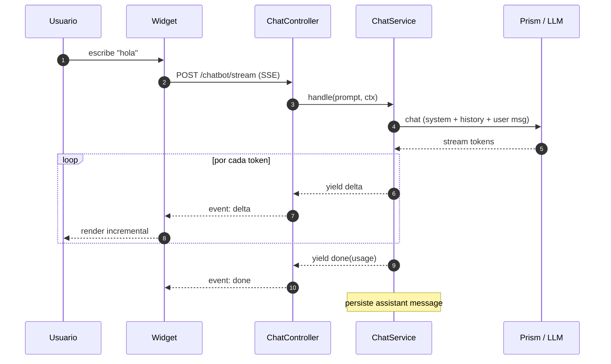
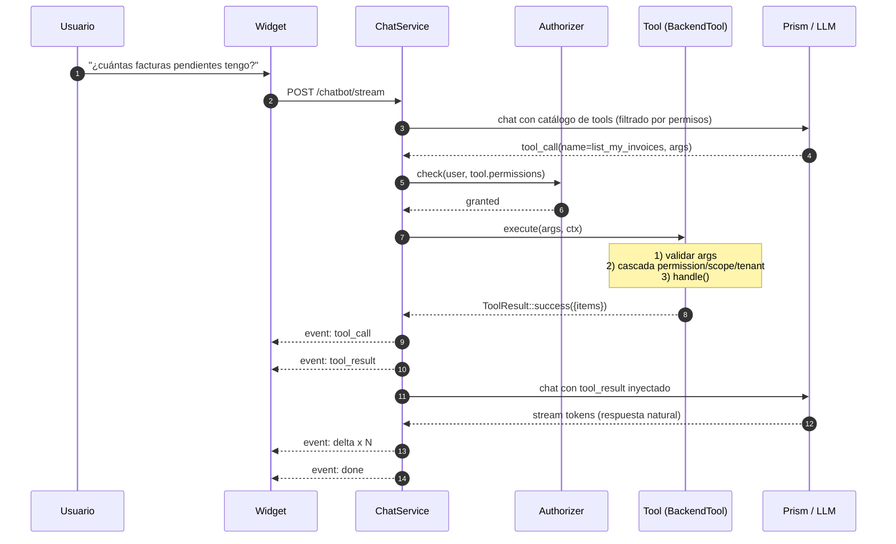
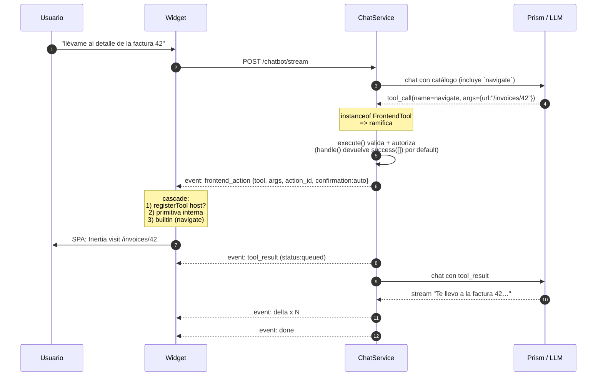

# Getting Started

> **Nota sobre versiones**: este documento contiene referencias internas
> (`v1.x`, `v2.x`, finding `#N`) a milestones del periodo pre-0.4, no a
> releases públicas. La release actual es `0.4.0`; toda la funcionalidad
> descrita aquí está disponible en ella.

> Guía end-to-end del integrador. Si eres dev de un proyecto Laravel y necesitas
> levantar `rnkr69/lara-chatbot` en una tarde sin pedir ayuda, este es tu sitio.
>
> Pre-requisitos cubiertos en [Requisitos](#1-requisitos). Si ya pasaste por
> `composer require rnkr69/lara-chatbot` y `chatbot:install`, salta al
> [Hola mundo](#3-hola-mundo-tu-primera-conversacion) o al
> [Primera tool end-to-end](#5-primera-tool-end-to-end).

---

## 1. Requisitos

| Componente | Versión | Notas |
|---|---|---|
| PHP | `^8.2` | Testeado en 8.2 / 8.3 / 8.4. Requiere `ext-pdo`, `ext-json`, `ext-mbstring`. |
| Laravel | `^11.0` o `^12.0` | El paquete soporta las dos últimas mayors. |
| Base de datos | MySQL ≥ 8.0, PostgreSQL ≥ 13, SQLite | Cualquier driver soportado por Eloquent + JSON columns. |
| LLM provider | Anthropic / OpenAI / Groq / Gemini / Mistral / Ollama | Cualquiera soportado por [Prism](https://github.com/prism-php/prism). |
| Node + npm | `node ≥ 20`, `npm ≥ 10` | Sólo si vas a customizar el widget; el bundle precompilado se publica vía `vendor:publish --tag=chatbot-assets`. |

**Instalación desde el repositorio.** El paquete se consume vía un repositorio
VCS de Composer apuntando a `https://github.com/rnkr69/lara-chatbot.git` (ver
§2.1). Detalle de alternativas Satis / Packeton / Private Packagist en
[`distribution.md`](distribution.md).

**Ruta de login del host.** El paquete monta `/chatbot*` detrás del middleware
`auth` (`chatbot.route.middleware`). Cuando un usuario sin sesión accede a una
de esas rutas, el guard `auth` de Laravel redirige a la ruta **nombrada `login`**.
Si tu host no la define —Backpack, por ejemplo, registra `backpack.auth.login`,
no `login`— la petición revienta con `RouteNotFoundException: Route [login] not
defined` → **HTTP 500** en vez de un redirect limpio al login. Define una ruta
`login`, **o** configura `redirectGuestsTo()` en `bootstrap/app.php`:

```php
->withMiddleware(function (Middleware $middleware) {
    // Apunta a la ruta de login real del host (Backpack, Filament, custom…).
    $middleware->redirectGuestsTo(fn () => route('backpack.auth.login'));
})
```

Afecta a cualquier ruta `auth` del host, no sólo a las del chatbot — pero v2.0
lo hace evidente al exponer un link directo a `/chatbot/dashboard` en el nav.

---

## 2. Instalación rápida

### 2.1 Declarar el repositorio en `composer.json`

```json
{
    "repositories": [
        {
            "type": "vcs",
            "url": "https://github.com/rnkr69/lara-chatbot.git"
        }
    ],
    "require": {
        "rnkr69/lara-chatbot": "^1.0"
    }
}
```

### 2.2 Instalar y ejecutar el wizard

```bash
composer update rnkr69/lara-chatbot
php artisan chatbot:install
```

El wizard `chatbot:install` te guía a través de 9 pasos idempotentes:

1. **Publicar config** (`config/chatbot.php`).
2. **Publicar migraciones** (2 tablas: `chatbot_conversations`, `chatbot_messages`,
   `chatbot_pending_actions`).
3. **Publicar vistas** (`system_prompt.blade.php`, `page.blade.php`).
4. **Publicar lang** (`en/`, `es/`).
5. **Provider + modelo del LLM** — elige uno de los 6 presets, escribe la API key
   en `.env`. Si la key ya existe en `.env`, **se preserva** (no se sobrescribe).
6. **Detectar Spatie** — si `spatie/laravel-permission` está instalado, propone
   `SpatieAuthorizer`; si no, default `gate`.
7. **Stub `ScopeResolver`** — genera `app/Chatbot/Authorization/AppScopeResolver.php`
   con el patrón `Self|Team|All`.
8. **Opt-in `TenantResolver`** — si tu app necesita una 4ª dimensión de aislamiento
   (corporación, evento, espacio…), el wizard genera el stub.
9. **Opt-in `ListMyInvoicesTool`**, **`system_prompt_addendum.blade.php`** y
   **layout injection** del snippet `<chatbot-widget>`.

**Modos del wizard:**

```bash
php artisan chatbot:install                  # interactivo
php artisan chatbot:install --no-interaction # defaults seguros (no toca código del host)
php artisan chatbot:install --force          # sobrescribe publishables existentes
```

### 2.3 Migrar

```bash
php artisan migrate
```

### 2.4 Verificar conexión LLM

```bash
php artisan chatbot:test-connection
```

Lanza un `ping` → `pong` contra el provider configurado. Si falla, ver
[`troubleshooting.md`](troubleshooting.md#l1-fallos-de-conexion-llm).

---

## 3. Hola mundo: tu primera conversación

### 3.1 Inyectar el widget

Si **no** marcaste "layout injection" en el wizard, añade manualmente el snippet
antes de `</body>` en tu layout principal (`resources/views/layouts/app.blade.php`):

```blade
{{-- chatbot:widget --}}
<chatbot-widget
    data-endpoint="{{ route('chatbot.stream') }}"
    data-position="bottom-right"
    data-default-open="false">
</chatbot-widget>
<script src="{{ asset('vendor/chatbot/chatbot-widget.js') }}" defer></script>
```

> Si no ves `vendor/chatbot/chatbot-widget.js` en `public/`, ejecuta
> `php artisan vendor:publish --tag=chatbot-assets`.

#### Hosts MPA y rehidratación del historial

Si tu layout monta `<chatbot-widget>` en una app **MPA** (Laravel server-rendered,
Backpack, WordPress admin, cualquier shell que recarga el HTML al navegar), el
widget se vuelve a montar en cada página. Para que el historial del chat
sobreviva a esas navegaciones, el bundle necesita poder resolver el endpoint
de conversaciones.

Por defecto **deriva** la URL de `data-endpoint` cambiando `/stream` por
`/conversations` (el patrón canónico que sirve el paquete), así que el snippet
de arriba funciona tal cual. Si tus rutas no siguen ese patrón (prefijo custom,
subdominio, route name remapped), declara el atributo explícito:

```blade
<chatbot-widget
    data-endpoint="{{ route('chatbot.stream') }}"
    data-conversations-endpoint="{{ route('chatbot.conversations.index') }}"
    data-position="bottom-right"
    data-default-open="false">
</chatbot-widget>
```

Cuando el atributo explícito está presente siempre gana sobre la deriva. Ver
[`WIDGET.md`](WIDGET.md#atributos-del-web-component) para la tabla completa.

#### Sincronizar el modo claro/oscuro con el toggle del host

Si tu admin tiene un selector light/dark (Backpack-Tabler, Tabler standalone,
AdminLTE, Filament — cualquier shell que escribe `<html data-bs-theme>`) y
quieres que el widget acompañe al resto del chrome, añade `data-theme="auto"`:

```blade
<chatbot-widget
    data-endpoint="{{ route('chatbot.stream') }}"
    data-position="bottom-right"
    data-theme="auto"
    data-default-open="false">
</chatbot-widget>
```

En `auto` (default desde v2.2.2) el widget resuelve el modo en este orden:
(1) `<html data-bs-theme>` si el host lo declara, (2) `prefers-color-scheme`
del SO. Además observa cambios runtime de ambas señales — el usuario pulsa
el icono del topbar, el widget se actualiza al instante sin reload. Para
forzar un modo concreto independientemente del host, declara
`data-theme="light"` o `data-theme="dark"`.

#### Registrar host hooks sin race con `defer`

Cuando cargas `chatbot-widget.js` con `defer` y un segundo script del host (con
`registerTool`, `registerBlockRenderer`, `registerNavigator`…) también con `defer`,
ambos esperan a `DOMContentLoaded` y se ejecutan en orden. Si el bundle ya
inicializó la API y emitió `chatbot:ready` antes de que el segundo script
adjunte su listener, el listener nunca se dispara.

Desde **v1.1** la API expone `whenReady(cb)` que evita esa carrera con
double-check interno (si la API ya está lista, defiere `cb` a un microtask;
si no, escucha el evento `chatbot:ready` con `{once: true}`):

```js
// resources/js/chatbot-actions.js (cargado con defer detrás del bundle)
window.Chatbot.whenReady(() => {
  window.Chatbot.registerTool('open_invoice_drawer', /* … */);
  window.Chatbot.registerNavigator(/* … */);
});
```

Si tu script se carga **antes** que el bundle (poco común), `window.Chatbot`
todavía no existe — usa el evento directamente:

```js
document.addEventListener('chatbot:ready', () => {
  window.Chatbot.whenReady(() => { /* registrations */ });
}, { once: true });
```

### 3.2 Probar

1. Abre tu app autenticado (rutas con middleware `auth` por default).
2. Click en el FAB del widget (esquina inferior derecha).
3. Escribe "hola".

Si el bot responde, está funcionando. **Si no responde**, ver
[`troubleshooting.md`](troubleshooting.md#m1-el-widget-aparece-pero-no-responde).

---

## 4. Cómo funciona

> Cuatro flujos cubren el 95% de las interacciones. Los diagramas siguientes son
> deliberadamente compactos; el detalle técnico vive en `LARA_CHATBOT_ROADMAP.md`
> §1–2.

### 4.1 Chat simple (sin tools)



### 4.2 Tool call (Backend)



### 4.3 Tool call (Frontend)



### 4.4 Confirmación de usuario (`confirmation=confirm`/`manual`)


> **Backend tools en v1**: sólo soportan `confirmation=auto`. Para "confirmación
> dura" en backend, declara una **frontend tool** con `confirmation=confirm` que
> dispare la backend tool al confirmarse. Detalle en
> [`confirmation-flow.md`](confirmation-flow.md).

---

## 5. Primera tool end-to-end

> Vamos a construir `ListMyInvoicesTool`: el LLM puede llamarla para enumerar las
> facturas accesibles al usuario. Tiempo objetivo: 10 minutos.

### 5.1 Modelo de dominio (mock)

Asumimos que tienes un modelo `App\Models\Invoice` con columnas
`id, user_id, status, total, created_at`. Si no lo tienes, puedes generarlo con:

```bash
php artisan make:model Invoice --migration
```

```php
// database/migrations/xxxx_create_invoices_table.php
Schema::create('invoices', function (Blueprint $table) {
    $table->id();
    $table->foreignId('user_id')->constrained()->cascadeOnDelete();
    $table->enum('status', ['paid', 'pending', 'cancelled']);
    $table->decimal('total', 10, 2);
    $table->timestamps();
});
```

### 5.2 Stub de la tool

```bash
php artisan chatbot:make:tool ListMyInvoices
```

Genera `app/Chatbot/Tools/ListMyInvoicesTool.php`. Ábrelo y rellena:

```php
namespace App\Chatbot\Tools;

use App\Models\Invoice;
use Rnkr69\LaraChatbot\Authorization\AccessScope;
use Rnkr69\LaraChatbot\Tools\BaseBackendTool;
use Rnkr69\LaraChatbot\Tools\ToolContext;
use Rnkr69\LaraChatbot\Tools\ToolResult;

class ListMyInvoicesTool extends BaseBackendTool
{
    public function name(): string { return 'list_my_invoices'; }

    public function description(): string
    {
        return 'Lista las facturas accesibles al usuario actual con filtros opcionales.';
    }

    public function parameters(): array
    {
        return [
            'type' => 'object',
            'properties' => [
                'status' => [
                    'type' => 'string',
                    'enum' => ['paid', 'pending', 'cancelled'],
                    'description' => 'Filtra por estado.',
                ],
                'limit' => [
                    'type' => 'integer',
                    'description' => 'Máximo de filas (default 20, máx 100).',
                ],
            ],
            'required' => [],
        ];
    }

    public function permissions(): array { return ['invoices.view']; }

    public function defaultScope(): AccessScope { return AccessScope::Self; }

    public function handle(array $args, ToolContext $ctx): ToolResult
    {
        $rows = $this->accessibleQuery(Invoice::query(), $ctx)
            ->when($args['status'] ?? null, fn ($q, $s) => $q->where('status', $s))
            ->limit(min($args['limit'] ?? 20, 100))
            ->orderByDesc('created_at')
            ->get(['id', 'status', 'total', 'created_at']);

        return ToolResult::success(['items' => $rows->toArray()]);
    }
}
```

### 5.3 Permiso

Si tu app usa **Spatie**, da el permiso al rol relevante:

```php
// database/seeders/RoleSeeder.php
$role = Role::firstOrCreate(['name' => 'employee']);
$role->givePermissionTo('invoices.view');
```

Si tu app usa **Gate**, regístralo en `AuthServiceProvider`:

```php
Gate::define('invoices.view', fn ($user) => true); // política según tu app
```

### 5.4 ScopeResolver del host

El stub generado en `chatbot:install` (`app/Chatbot/Authorization/AppScopeResolver.php`)
ya resuelve `Self → [user.id]`. Para `Team` (managers), edita:

```php
public function resolveTeam($user): array
{
    return $user->teamMembers()->pluck('id')->all();
}
```

Detalle completo en [`authorization.md`](authorization.md).

### 5.5 Probar

```text
Tú: ¿qué facturas tengo pendientes?
Bot: Tienes 3 facturas pendientes:
     - #105 — 1.250 € (hace 2 días)
     - #112 — 890 € (hace 5 horas)
     - #118 — 320 € (hace 1 hora)
     ¿Quieres ver el detalle de alguna?
```

> **No aparece la tool en el catálogo**: revisa `chatbot.tools.auto_discover=true`
> y `chatbot.tools.paths=['app/Chatbot/Tools']`. Verifica con
> `php artisan chatbot:tools:list`.
>
> **El LLM no la usa aunque exista**: ajusta `description()` para que sea claro
> *cuándo* invocarla. El LLM elige tools por la descripción.

---

## 6. Primera frontend tool

> Frontend tools son tools que el LLM "razona" como cualquier otra pero cuyo
> efecto material lo materializa el widget en el navegador. Catálogo built-in:
> `navigate`, `toggle_visibility`, `fill_form`, `show_toast`, `open_modal`,
> `render_block`, `invoke_host_action`, `download_file`.
>
> Para acciones específicas de tu app que no encajen en las primitivas, usa
> `invoke_host_action` + un handler JS:

### 6.1 Tool PHP (shim)

```php
namespace App\Chatbot\Tools;

use Rnkr69\LaraChatbot\Tools\BaseFrontendTool;

class OpenInvoiceDrawerTool extends BaseFrontendTool
{
    public function name(): string { return 'open_invoice_drawer'; }
    public function description(): string
    {
        return 'Abre el drawer lateral con el detalle de una factura por su id.';
    }
    public function parameters(): array
    {
        return [
            'type' => 'object',
            'properties' => [
                'invoice_id' => ['type' => 'integer'],
            ],
            'required' => ['invoice_id'],
        ];
    }
    public function permissions(): array { return ['invoices.view']; }
}
```

### 6.2 Handler JS

En tu bundle principal (`resources/js/app.ts` o donde montes el widget):

```javascript
window.Chatbot.registerTool('open_invoice_drawer', async ({ invoice_id }) => {
    const drawer = document.querySelector('app-invoice-drawer');
    if (!drawer) {
        return { success: false, error: 'drawer_not_mounted' };
    }
    drawer.open(invoice_id);
    return { success: true };
});
```

Detalle completo en [`FRONTEND_TOOLS.md`](FRONTEND_TOOLS.md).

---

## 7. Próximos pasos

| Necesito… | Lee |
|---|---|
| Entender la cascada permission → scope → tenant → ownership | [`authorization.md`](authorization.md) |
| Activar el Personal Dashboard (pinear bloques, modo `layout` vs standalone) | [`dashboard.md`](dashboard.md) |
| Construir tools de backend complejas (bulk, MCP, eventos) | [`backend-tools.md`](backend-tools.md) |
| Construir tools de frontend (formularios, navegación, descargas) | [`FRONTEND_TOOLS.md`](FRONTEND_TOOLS.md) |
| Renderizar bloques tipados (cards, tablas, gráficas) | [`block-renderers.md`](block-renderers.md) |
| Inyectar contexto de la página actual al LLM | [`page-context.md`](page-context.md) |
| Pedir confirmación antes de ejecutar acciones destructivas | [`confirmation-flow.md`](confirmation-flow.md) |
| Conectar servidores MCP externos | [`mcp.md`](mcp.md) |
| Customizar el widget (theming, slots, web component) | [`WIDGET.md`](WIDGET.md) |
| Integración con Backpack (admin) | [`integrations/backpack.md`](integrations/backpack.md) |
| Desplegar a producción (CDN, SSE detrás de proxy, rate limit) | [`deployment.md`](deployment.md) |
| Algo va mal en runtime | [`troubleshooting.md`](troubleshooting.md) |
| Distribuir versiones del paquete | [`distribution.md`](distribution.md) |
| Correr la suite de tests del paquete | [`testing.md`](testing.md) |

---

## 8. Checklist de "estoy listo para producción"

- [ ] `composer require` instalado y `chatbot:install` ejecutado.
- [ ] Migrations corridas (`chatbot_conversations`, `chatbot_messages`,
      `chatbot_pending_actions` presentes).
- [ ] `chatbot:doctor` no reporta errores (verifica config + auth + DB +
      assets + LLM + tools en una sola pasada — v1.1.1).
- [ ] `chatbot:test-connection` responde `pong`.
- [ ] Al menos una tool de host con `permissions()` declaradas.
- [ ] `ScopeResolver` con `resolveTeam`/`resolveAll` implementados (no devolviendo
      `[]`).
- [ ] Si tu app es multi-tenant: `TenantResolver` registrado y todas las tools
      sensibles con `tenantScope=true`.
- [ ] `chatbot.system_prompt.addendum_view` apunta a una vista del host con tono
      / dominio / glosario propios.
- [ ] Layout principal contiene `<chatbot-widget>` + `<script src="…/chatbot-widget.js">`.
- [ ] Asset publicado: `public/vendor/chatbot/chatbot-widget.js` accesible.
- [ ] CSP / proxy permite SSE (`text/event-stream`, sin buffering). Ver
      [`deployment.md`](deployment.md).
- [ ] Listener de `Rnkr69\LaraChatbot\Events\ToolInvoked` registrado en
      `EventServiceProvider` para auditoría.
- [ ] Si usas la página de chat (`/chatbot`) o el Personal Dashboard
      (`/chatbot/dashboard`): `chatbot.page.layout` / `chatbot.dashboard.layout`
      apuntan a un layout del host. **Sin layout configurado esas páginas
      corren standalone — sin la navegación del host**; en ese caso setea al
      menos `chatbot.{page,dashboard}.back_url` para no dejarlas como islas sin
      salida. Ver [`dashboard.md`](dashboard.md) §5.2.

Si todos los checks están en verde: estás listo. ¡Buen viaje!
