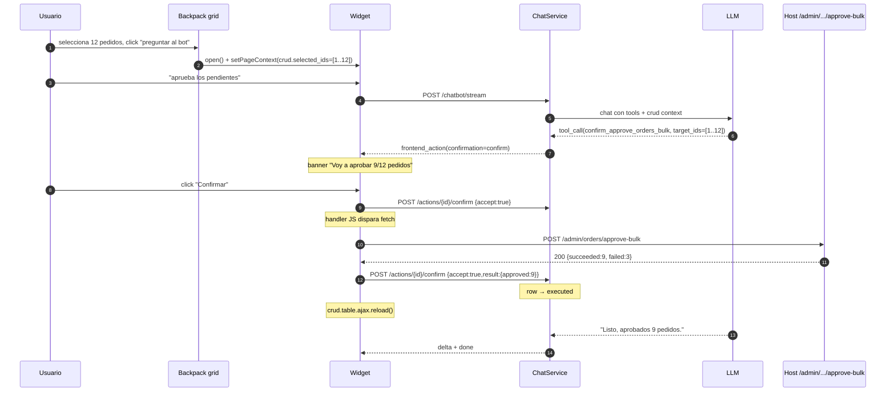

# Integration · Backpack CRUD

*[English](backpack.md) · Español*

> Recetas para hosts que usan **Backpack** como capa admin. Cubre el page
> context provider que el paquete trae out-of-the-box, las convenciones
> `data-chatbot-*` recomendadas para grids Backpack, y un ejemplo end-to-end
> de bulk action.
>
> Pre-lectura: [`page-context.es.md`](../page-context.es.md) (cómo el bot sabe qué
> ve el usuario) + [`FRONTEND_TOOLS.es.md`](../FRONTEND_TOOLS.es.md) (cómo el bot
> ejecuta acciones en el navegador).

---

## 1. ¿Por qué este doc?

Los pilotos del paquete tienen sus admins construidos
con Backpack. La conversación natural en un grid Backpack es:

- *"Aprueba todos los pedidos seleccionados."*
- *"Filtra los eventos del 2026 con asistencia > 50."*
- *"Muéstrame el detalle del cliente que está en la primera fila."*

Para que el LLM pueda razonar sobre estos casos, necesita **saber** qué
entidad estás editando, qué filtros tiene aplicados el grid, y qué filas (si
hay) están seleccionadas. Backpack expone esa información a través de
`app('crud')`; el paquete trae un provider que la lee y la pone en el page
context, y un par de convenciones que el host adopta opcionalmente.

---

## 2. Activación

La integración es **opt-in por presencia en runtime**:

- Si `class_exists('Backpack\\CRUD\\app\\Library\\CrudPanel\\CrudPanel')` al
  boot, el `ChatbotServiceProvider` registra el `BackpackPageContextProvider`
  + la directive Blade `@chatbotBackpackContext`.
- Si Backpack no está instalado, no se registra nada — la directive en
  layouts no-admin emite cadena vacía sin fallar.

No tienes que tocar nada en `composer.json`; el paquete **no** depende de
Backpack.

---

## 3. La directive `@chatbotBackpackContext`

Coloca esta directive en tu **layout admin** (típicamente
`vendor/backpack/crud/src/resources/views/ui/layouts/top_left_menu.blade.php`
o el layout custom de tu app), en el `<head>`:

```blade
<head>
    {{-- ... el resto de tu head ... --}}

    @chatbotBackpackContext

    {{-- meta CSRF, etc. --}}
</head>
```

> ⚠️ **No envuelvas `@chatbotBackpackContext` en `@push('after_styles')`
> ni en ningún otro `@push` que cargue desde el final del `<body>`.**
> Backpack flushes `@stack('after_styles')` mientras renderiza el `<head>`;
> si tu partial se incluye al final del body (como hace
> `vendor/backpack/theme-tabler/.../scripts.blade.php`), el push se ejecuta
> **después** de que el stack ya se haya vaciado y el meta tag nunca llega
> al DOM. Resultado: `document.querySelector('meta[name="chatbot:context"]')`
> devuelve `null` aunque el provider haya resuelto schema correctamente.
>
> Emite la directive **inline** en el sitio donde quieres que aparezca:
>
> ```blade
> @once
> @chatbotBackpackContext
>
> @push('after_scripts')
>     <chatbot-widget data-endpoint="{{ route('chatbot.stream') }}" ...></chatbot-widget>
>     <script src="{{ asset(config('chatbot.widget.asset_path')) }}" defer></script>
> @endpush
> @endonce
> ```
>
> El widget acepta el `<meta>` en cualquier parte del DOM — no tiene por qué
> vivir en el `<head>`.

Cuando estás en una página Backpack con un `CrudPanel` resuelto, esto
renderiza algo como:

```html
<meta name="chatbot:context" content='{"crud":{"entity":"App\\Models\\Order","action":"index","filters":{"status":"pending"},"selected_ids":[12,15,18]}}'>
```

En páginas no-Backpack, la directive no emite nada (el meta tag puede ser
añadido por otra fuente, e.g. una vista de listado pública).

### 3.1 Shape del payload `crud`

```typescript
{
    crud: {
        entity?: string;        // Nombre amigable: 'Order' (no FQCN). v1.1.1.
        entity_class?: string;  // FQCN del modelo: 'App\\Models\\Order'. Sólo
                                // se emite si NO es redundante con `entity`
                                // (i.e. cuando entity_name custom de Backpack
                                // difiere de class_basename(modelo)).
        action?: string;        // 'list' | 'show' | 'create' | 'update' | 'destroy' | tu operación custom
        filters?:
            | Record<string, scalar>           // legacy / no-list: querystring aplicado
            | {                                 // list view con filters() declarados
                  applied: Record<string, scalar>;
                  available: Array<{
                      name: string;
                      type?: string;            // 'dropdown' | 'date_range' | 'text' | ...
                      options?: Array<{value: string|number, label: string} | string>;
                  }>;
              };
        form?: {                                // sólo en create/update/edit
            selector: string;                   // Selector CSS estable basado en el
                                                // contrato `bp-section` de Backpack 5/6/7:
                                                // '[bp-section="crud-operation-create"] form'.
                                                // Funciona sin overrides de views ni id
                                                // en el `<form>` real. Páselo verbatim
                                                // como `fill_form({selector, fields, ...})`.
            fields: Array<{
                name: string;
                label: string;
                type: string;                   // 'text' | 'select' | 'datetime' | 'enum' | ...
                options?: Array<{value: string|number, label: string}>;
                options_truncated?: true;       // FK select cuyo target supera
                                                // chatbot.backpack.fk_options_cap: el LLM
                                                // debe recurrir a un read tool (`list_*`)
                                                // para resolver labels → ids.
                required?: true;
            }>;
        };
        selected_ids?: (int|string)[];          // bulk: viene de `entries[]` o `selected_ids[]`
    }
}
```

Campos vacíos se omiten para mantener el meta tag compacto. Si todo está
vacío, la directive no emite nada.

> **Cambio respecto a v1.1.0**: `entity` antes emitía la FQCN
> (`App\\Models\\Order`). Desde v1.1.1 emite el nombre amigable (`Order`)
> para ahorrar tokens al LLM; la FQCN se expone como `entity_class` sólo
> cuando aporta información (Backpack `entity_name` custom). El nuevo campo
> `form` aparece en `create`/`update`/`edit` y los filtros del listado
> ahora también listan los **disponibles** para que el LLM pueda razonar
> sobre qué columna filtrar antes de ejecutar `fill_form`.
>
> **Cambio respecto a v1.1.1 (1.1.2)**: `form.id` se reemplaza por
> `form.selector`. El `id` inventado no llegaba al DOM porque Backpack
> default no taggea sus `<form>`. El nuevo `selector` se apoya en el
> contrato `bp-section` que Backpack 5/6/7 emite por defecto y funciona
> sin overrides. Los FK select fields ahora también enumeran sus
> `options` server-side hasta `chatbot.backpack.fk_options_cap` (default
> 200); pasada esa cuenta, el campo lleva `options_truncated: true` y el
> LLM debe usar un read tool para resolver.

### 3.2 Combinar con tus propios datos

Si tienes datos del host que quieres añadir al page context además del CRUD,
combínalos en JS tras el boot:

```javascript
// En tu bundle admin
window.addEventListener('chatbot:context-changed', () => {
    // El widget ya leyó el meta tag y aplicó {crud: ...}.
    // Ahora añadimos lo nuestro:
    window.Chatbot.setPageContext({
        ui: {
            theme: document.documentElement.dataset.theme ?? 'light',
            sidebar_collapsed: document.body.classList.contains('sidebar-collapsed'),
        },
    });
});
```

Recuerda que `setPageContext` hace **merge superficial true**: no
reemplaza `crud`, lo extiende.

---

## 4. Convenciones `data-chatbot-*` para grids Backpack

Si quieres que el LLM pueda **operar** sobre el grid (no sólo leerlo),
adopta estos atributos en tu blade del listado:

```blade
{{-- vendor/backpack/crud/src/resources/views/crud/list.blade.php --}}
<table id="crudTable"
       class="table table-striped"
       data-chatbot-grid="orders"
       data-chatbot-entity="{{ App\Models\Order::class }}">
    <thead>
        <tr>
            <th><input type="checkbox" data-chatbot-select-all></th>
            <th data-chatbot-column="id">ID</th>
            <th data-chatbot-column="customer">Cliente</th>
            <th data-chatbot-column="total">Total</th>
            <th data-chatbot-column="status">Estado</th>
        </tr>
    </thead>
    <tbody>
        @foreach($entries as $entry)
            <tr data-chatbot-row data-chatbot-row-id="{{ $entry->id }}">
                <td><input type="checkbox" name="entries[]" value="{{ $entry->id }}"></td>
                <td>{{ $entry->id }}</td>
                <td>{{ $entry->customer->name }}</td>
                <td>{{ $entry->total }} €</td>
                <td>{{ $entry->status }}</td>
            </tr>
        @endforeach
    </tbody>
</table>
```

| Atributo | En | Significado |
|---|---|---|
| `data-chatbot-grid="orders"` | `<table>` | identifica el grid completo |
| `data-chatbot-entity="App\\Models\\Order"` | `<table>` | FQCN del modelo (matching el `crud.entity` del context) |
| `data-chatbot-select-all` | checkbox `<thead>` | el botón "select all" del grid |
| `data-chatbot-column="status"` | `<th>` | nombre lógico de la columna |
| `data-chatbot-row` | `<tr>` | fila accionable |
| `data-chatbot-row-id="42"` | `<tr>` | id del registro |

Frontend tools del catálogo built-in que se benefician:

- `toggle_visibility` con `target="[data-chatbot-grid]"` muestra/oculta el
  grid.
- `fill_form` con `target="filtersForm"` rellena los filtros del grid.
- `render_block` con `data.row_id` permite responder con un card/table
  inline en chat referenciando la fila que el usuario tiene a la vista.

---

## 5. Forms de create / update

Cuando el LLM tiene que rellenar un `<form>` Backpack (Crear misión, Editar
factura, etc.), la primitiva `fill_form` necesita:

1. Una forma estable de **localizar** el `<form>` que vive en la página.
2. Saber qué `name` HTML tiene cada control y, para selects con FK, qué
   valor entero esperar para cada label que el usuario diría.

### 5.1 Form schema en page context (automático)

`BackpackPageContextProvider` emite `crud.form.{selector, fields[...]}`
cuando `action ∈ {create, update, edit}`. Cada field expone
`{name, label, type, options?, options_truncated?, required?}`, y los
selects con FK serializan options como `[{value, label}]` para que el LLM
mapee "Mars" → "2" sin guessing.

El `selector` se basa en el contrato `bp-section`
estable que Backpack 5/6/7 emite en `crud::create.blade.php` /
`crud::edit.blade.php` / `crud::inc.form_page.blade.php`:

```html
<div class="row" bp-section="crud-operation-create">
    <form action="/admin/mission" method="post">...</form>
</div>
```

`'[bp-section="crud-operation-create"] form'` matchea el form correcto
sin overrides de views, sin necesidad de tagear el `<form>` con `id` o
`data-chatbot-form`, y funciona igual en operaciones `create` / `update` /
HasForm custom.

Esto es out-of-the-box: con `chatbot:install` y
`class_exists('Backpack\\CRUD\\...')` detectado, el provider hace su trabajo
en cualquier ruta CRUD del host. No hace falta tagear nada.

Ejemplo de lo que ve el LLM en `## Current page` al estar en
`/admin/mission/create`:

```json
{
  "crud": {
    "entity": "Mission",
    "action": "create",
    "form": {
      "selector": "[bp-section=\"crud-operation-create\"] form",
      "fields": [
        {"name": "origin_planet_id", "label": "Origin planet", "type": "select",
         "options": [{"value": 1, "label": "Earth"}, {"value": 2, "label": "Mars"}]},
        {"name": "departure_at", "label": "Departure at", "type": "datetime"},
        {"name": "priority", "label": "Priority", "type": "enum",
         "options": [{"value": "standard", "label": "Standard"}]}
      ]
    }
  }
}
```

Y con eso el LLM puede llamar:

```json
{
  "tool": "fill_form",
  "args": {
    "selector": "[bp-section=\"crud-operation-create\"] form",
    "fields": [
      {"name": "origin_planet_id", "value": 1},
      {"name": "departure_at", "value": "2026-08-15T08:30"},
      {"name": "priority", "value": "express"}
    ]
  }
}
```

— pasando el `selector` verbatim, con los `name` HTML correctos y los
valores ya mapeados de label a id.

> **FK demasiado grandes**: si la tabla referenciada por un select supera
> `chatbot.backpack.fk_options_cap` (default 200), el provider emite el
> field con `options_truncated: true` y omite `options`. El LLM debe
> recurrir a un read tool (`list_planets`, `list_ships`, …) para resolver
> la pareja label → id antes de llamar `fill_form`.

### 5.2 Tagear el `<form>` (opcional, casi nunca hace falta)

Como el `selector` basado en `bp-section` cubre el caso default sin
overrides, la mayoría de hosts no necesitan tagear nada. Si por algún
motivo quieres targeting por id (e.g. tu app tiene varios forms en la
misma URL con el mismo `bp-section`), puedes publicar este override:

```blade
{{-- resources/views/vendor/backpack/crud/inc/form_page.blade.php --}}
<form
    method="..."
    action="..."
    data-chatbot-form="{{ \Illuminate\Support\Str::kebab(class_basename($crud->getModel())) }}-{{ $operation }}">
    ...
</form>
```

> ⚠️ El override del partial `form_page.blade.php` **solo aplica a
> operaciones custom basadas en el trait `HasForm`** — las views
> built-in `crud::create.blade.php` y `crud::edit.blade.php` de
> Backpack 6.x tienen el `<form>` inline y no incluyen `form_page`.
> Para esos casos prefiere `selector` (out-of-the-box) o publica
> overrides de `create.blade.php` / `edit.blade.php`. `--backpack-forms`
> de `chatbot:install` queda como soporte legacy.

### 5.3 Aliases con `data-chatbot-field`

Para fields con `name` HTML interno feo (`metadata[options][0][value]`) el
host puede exponer un alias amigable:

```html
<input name="metadata[options][0][value]" data-chatbot-field="first_option">
```

El LLM ve `first_option` en el page context (cuando declares el alias en el
schema del provider o en `@chatbotForm`) y `fillForm` busca primero por
`[data-chatbot-field]` antes que por `[name]`. Si llama con un name que no
existe, el warn de "field not found" lista AMBOS conjuntos (`name` y
`data-chatbot-field`) para diagnóstico.

### 5.4 Confirmation flow

`fill_form` defaulta a `confirmation=confirm` — el widget muestra un
banner antes de rellenar / submit. Buen default para destructive flows.
Si quieres permitir auto-fill sin banner (e.g. un draft que el usuario
revisa antes de submit), subclasea `FillFormTool` y override
`confirmation()` para devolver `ConfirmationLevel::Auto`.

### 5.5 Comando `chatbot:install --backpack-forms` *(legacy)*

```
php artisan chatbot:install --backpack-forms
```

Copia el stub a `resources/views/vendor/backpack/crud/inc/form_page.blade.php`.
Idempotente — si ya existe, no sobreescribe sin `--force`. El flag es
opt-in (no aparece en el wizard interactivo) porque sobreescribe una
view específica del host y queremos que la decisión sea explícita.

> **v1.1.2 — uso menor.** Tras el aterrizaje de `crud.form.selector`
> basado en `bp-section`, este override solo aporta valor para
> operaciones HasForm custom donde quieres taggear el `<form>` con un
> `data-chatbot-form` estable. Las views built-in `crud::create.blade.php`
> y `crud::edit.blade.php` **no** invocan `inc.form_page`, así que el
> override no las afecta.

Si prefieres aplicarlo manualmente: copia el contenido de
`src/Console/Commands/stubs/backpack-form-page.stub` a tu override y
ajusta a tu gusto.

---

## 6. Ejemplo end-to-end · Bulk approve con confirmación

> **Caso**: el usuario tiene 12 pedidos seleccionados en el grid de Backpack.
> Pregunta al bot "aprueba todos los pendientes". El bot debe:
>
> 1. Leer los `selected_ids` del page context.
> 2. Filtrar a los que estén en estado `pending`.
> 3. Pedir confirmación al usuario ("Voy a aprobar 9 de los 12 pedidos
>    seleccionados…").
> 4. Al confirmar, ejecutar la backend tool real.
> 5. Refrescar el grid.

### 6.1 Backend tool — `ApproveOrdersBulkTool`

Patrón bulk estándar (ver [`backend-tools.es.md §5`](../backend-tools.es.md)):

```php
namespace App\Chatbot\Tools;

use App\Models\Order;
use Rnkr69\LaraChatbot\Authorization\AccessScope;
use Rnkr69\LaraChatbot\Tools\BaseBackendTool;
use Rnkr69\LaraChatbot\Tools\ToolContext;
use Rnkr69\LaraChatbot\Tools\ToolResult;

class ApproveOrdersBulkTool extends BaseBackendTool
{
    public function name(): string { return 'approve_orders_bulk'; }

    public function description(): string
    {
        return 'Aprueba en bloque varios pedidos por sus IDs. Usa esta tool '
             . 'cuando el usuario pide aprobar más de un pedido a la vez '
             . '(seleccionados en el grid o enumerados explícitamente).';
    }

    public function parameters(): array
    {
        return [
            'type' => 'object',
            'properties' => [
                'target_ids' => [
                    'type' => 'array',
                    'description' => 'Lista de IDs de pedidos a aprobar (máx 100).',
                ],
                'reason' => [
                    'type' => 'string',
                    'description' => 'Razón opcional para el log de auditoría.',
                ],
            ],
            'required' => ['target_ids'],
        ];
    }

    public function permissions(): array { return ['orders.approve']; }

    public function defaultScope(): AccessScope { return AccessScope::Team; }

    public function handle(array $args, ToolContext $ctx): ToolResult
    {
        $ids = array_slice((array) $args['target_ids'], 0, 100);

        $orders = $this->accessibleQuery(Order::query(), $ctx)
            ->whereIn('id', $ids)
            ->where('status', 'pending')   // sólo pendientes
            ->lockForUpdate()
            ->get()
            ->keyBy('id');

        $succeeded = $failed = [];

        foreach ($ids as $id) {
            $order = $orders->get($id);
            if (! $order) {
                $failed[] = ['id' => $id, 'reason' => 'not_pending_or_not_owner'];
                continue;
            }
            try {
                $order->approve($args['reason'] ?? null);
                $succeeded[] = ['id' => $id];
            } catch (\Throwable $e) {
                $failed[] = ['id' => $id, 'reason' => 'runtime'];
            }
        }

        return ToolResult::success([
            'requested' => count($ids),
            'succeeded' => $succeeded,
            'failed'    => $failed,
            'counts'    => [
                'ok'   => count($succeeded),
                'fail' => count($failed),
            ],
        ]);
    }
}
```

### 6.2 Frontend tool con confirmación — `ConfirmApproveOrdersBulkTool`

> **Por qué dos tools**: en v1 las backend tools no soportan
> `confirmation=confirm`. El patrón canónico es: una FE tool con
> `confirmation=confirm` que reciba los args, muestre el banner, y al
> confirmarse dispare la BE tool.

```php
namespace App\Chatbot\Tools;

use Rnkr69\LaraChatbot\Tools\BaseFrontendTool;
use Rnkr69\LaraChatbot\Tools\ConfirmationLevel;
use Rnkr69\LaraChatbot\Tools\ToolContext;
use Rnkr69\LaraChatbot\Tools\ToolResult;

class ConfirmApproveOrdersBulkTool extends BaseFrontendTool
{
    public function name(): string { return 'confirm_approve_orders_bulk'; }

    public function description(): string
    {
        return 'Pide confirmación al usuario antes de aprobar varios pedidos. '
             . 'Llama a esta tool cuando el usuario pida aprobar ≥2 pedidos.';
    }

    public function parameters(): array
    {
        return [
            'type' => 'object',
            'properties' => [
                'target_ids' => ['type' => 'array'],
                'preview'    => ['type' => 'string', 'description' => 'Texto a mostrar en el banner.'],
            ],
            'required' => ['target_ids', 'preview'],
        ];
    }

    public function permissions(): array { return ['orders.approve']; }

    public function confirmation(): ConfirmationLevel
    {
        return ConfirmationLevel::Confirm;
    }
}
```

### 6.3 Handler JS — recibe el "confirmed" y dispara la BE tool

El widget ya gestiona el banner. Cuando el usuario confirma, emite la
2ª llamada al endpoint con `result.done`. Pero la primitiva en sí — invocar
la backend tool real — la ejecutamos desde JS para que el LLM pueda recibir
el resultado en el siguiente turno:

```javascript
window.Chatbot.registerTool('confirm_approve_orders_bulk', async ({ target_ids }) => {
    // El usuario YA confirmó (el widget sólo invoca el handler tras
    // {accept: true}); ejecutamos la BE tool real.
    const csrf = document.querySelector('meta[name="csrf-token"]').content;

    const res = await fetch('/admin/orders/approve-bulk', {
        method: 'POST',
        credentials: 'same-origin',
        headers: {
            'Content-Type': 'application/json',
            'X-CSRF-TOKEN': csrf,
            'Accept': 'application/json',
        },
        body: JSON.stringify({ target_ids }),
    });

    if (! res.ok) {
        return { success: false, error: `http_${res.status}` };
    }

    const data = await res.json();

    // Refrescar el grid (Backpack usa DataTables)
    if (window.crud?.table) {
        window.crud.table.ajax.reload();
    }

    return {
        success: true,
        approved: data.succeeded.length,
        failed: data.failed.length,
    };
});
```

### 6.4 Endpoint host que la JS llama

```php
// routes/admin.php (o donde tu app coloque rutas Backpack)
Route::middleware(['auth', 'web'])
    ->post('/admin/orders/approve-bulk', function (Request $request) {
        // Reusa la backend tool (cascada de autorización idéntica)
        $tool = app(ApproveOrdersBulkTool::class);

        $ctx = new \Rnkr69\LaraChatbot\Tools\ToolContext(
            user: $request->user(),
            conversation: null,
            pageContext: [],
        );

        $result = $tool->execute(
            $request->validate(['target_ids' => 'array', 'reason' => 'nullable|string']),
            $ctx,
        );

        return response()->json($result->toArray(), $result->isOk() ? 200 : 422);
    });
```

> Aquí estamos llamando `execute()` (no `handle()`) directamente; la cascada
> de autorización se aplica igual que cuando viene del LLM. Si quieres
> exponerlo *sin* la cascada — porque ya validaste con un middleware del
> host — llama a `handle()` directamente.

### 6.5 Bloque tipado custom — `crud_row`

Para que el bot pueda mostrar una fila del grid en el chat de forma rica
(en lugar de listarlas como markdown), el host registra un block renderer:

```javascript
window.Chatbot.registerBlockRenderer('crud_row', (block, container) => {
    const { entity_label, fields, actions } = block.data;

    container.innerHTML = `
        <div class="cb-crud-row">
            <h4>${escapeHtml(entity_label)}</h4>
            <dl>
                ${Object.entries(fields).map(([k, v]) =>
                    `<dt>${escapeHtml(k)}</dt><dd>${escapeHtml(String(v))}</dd>`
                ).join('')}
            </dl>
            ${actions ? `
                <div class="cb-crud-actions">
                    ${actions.map(a => `
                        <button data-action="${a.tool}" data-args='${JSON.stringify(a.args)}'>
                            ${escapeHtml(a.label)}
                        </button>
                    `).join('')}
                </div>
            ` : ''}
        </div>
    `;

    container.querySelectorAll('button[data-action]').forEach(btn => {
        btn.addEventListener('click', () => {
            const tool = btn.dataset.action;
            const args = JSON.parse(btn.dataset.args);
            window.Chatbot.invokeTool(tool, args);
        });
    });
});

function escapeHtml(s) {
    const div = document.createElement('div');
    div.textContent = s;
    return div.innerHTML;
}
```

El LLM emite el bloque desde una tool de host:

```php
// app/Chatbot/Tools/GetOrderTool.php
public function handle(array $args, ToolContext $ctx): ToolResult
{
    $order = Order::find($args['order_id']);
    return ToolResult::success([
        'block' => [
            'type' => 'crud_row',
            'data' => [
                'entity_label' => "Pedido #{$order->id}",
                'fields' => [
                    'Cliente' => $order->customer->name,
                    'Total'   => "{$order->total} €",
                    'Estado'  => $order->status,
                ],
                'actions' => [
                    ['tool' => 'open_invoice_drawer', 'args' => ['invoice_id' => $order->invoice_id], 'label' => 'Ver factura'],
                    ['tool' => 'confirm_approve_orders_bulk', 'args' => ['target_ids' => [$order->id], 'preview' => 'Aprobar este pedido'], 'label' => 'Aprobar'],
                ],
            ],
        ],
    ]);
}
```

Detalle de bloques tipados en [`block-renderers.es.md`](../block-renderers.es.md).

---

## 7. Flujo completo — diagrama



---

## 8. Recetas adicionales

### 8.1 Filtrar el grid por la respuesta del LLM

```javascript
window.Chatbot.registerTool('apply_grid_filter', ({ filters }) => {
    if (! window.crud?.table) {
        return { success: false, error: 'no_grid' };
    }
    Object.entries(filters).forEach(([col, val]) => {
        window.crud.table.column(`${col}:name`).search(val);
    });
    window.crud.table.draw();
    return { success: true };
});
```

LLM puede emitir:
```
tool_call(apply_grid_filter, {filters: {status: 'pending', priority: 'high'}})
```

### 8.2 Abrir un drawer de detalle

Si tu app tiene drawers Backpack (sidebar lateral con detalle):

```javascript
window.Chatbot.registerTool('open_crud_show', ({ entity, id }) => {
    const url = `/admin/${entityToSlug(entity)}/${id}/show`;
    if (window.Inertia) {
        window.Inertia.visit(url, { preserveScroll: true });
    } else {
        window.location.assign(url);
    }
    return { success: true };
});
```

LLM puede emitir desde un block `actions`:
```
tool_call(open_crud_show, {entity: 'App\\Models\\Order', id: 42})
```

### 8.3 Refrescar la página tras una mutación

Las primitivas built-in incluyen `navigate` con `reload`. Para refrescar
*sin* navegar:

```javascript
window.Chatbot.registerTool('refresh_grid', () => {
    if (window.crud?.table) {
        window.crud.table.ajax.reload(null, false);
        return { success: true };
    }
    window.location.reload();
    return { success: true };
});
```

---

## 9. Troubleshooting específico

### B1 · La directive no emite nada

**Causa**: no estás en una página Backpack o `app('crud')` no está bound para
ese request.

**Verificación**:
```php
// En tu controller/middleware
if (app()->bound('crud') && ($panel = app('crud')) !== null) {
    dump('ok', $panel->getModel());
}
```

Si lo anterior funciona pero `@chatbotBackpackContext` aun así emite vacío,
abre un issue en el repo del paquete con tu versión de Backpack y un dump
del panel.

### B2 · `selected_ids` siempre vacío

**Causa**: tu grid usa otro nombre del campo. El provider lee `entries[]` y
`selected_ids[]` por default.

**Fix**: extiende el provider en tu host:

```php
namespace App\Chatbot\Authorization;

use Rnkr69\LaraChatbot\Integrations\Backpack\BackpackPageContextProvider;

class CustomBackpackProvider extends BackpackPageContextProvider
{
    protected function resolveSelectedIds(): array
    {
        $ids = parent::resolveSelectedIds();
        if ($ids === []) {
            $ids = array_filter((array) request()->input('my_custom_field', []));
        }
        return $ids;
    }
}
```

```php
// AppServiceProvider::register()
$this->app->singleton(
    \Rnkr69\LaraChatbot\Integrations\Backpack\BackpackPageContextProvider::class,
    \App\Chatbot\Authorization\CustomBackpackProvider::class,
);
```

### B3 · El meta tag escapa caracteres extraños

**Causa**: tu CrudPanel devuelve modelos con propiedades que contienen
`<`, `>`, `&` etc.

**Esperado**: el provider usa `JSON_HEX_QUOT|JSON_HEX_APOS` para que el JSON
se pueda envolver con `'…'` sin escapar manualmente. Caracteres unicode pasan
sin escape.

**Fix si ves un meta tag corrupto**: probablemente tu modelo tiene una
propiedad con bytes inválidos UTF-8. Revisa la columna en BD.

---

## 10. Limitaciones conocidas

- El provider **no** lee filtros guardados en sesión (Backpack persistence).
  Si dependes de eso, extiende el provider.
- `getModel()` en operaciones `create` puede devolver una instancia "vacía" —
  el `entity` amigable sigue resolviéndose desde `entity_name` o
  `class_basename`; el `form` schema se emite igualmente porque
  `$panel->fields()` está definido en la operación.
- El `chatbot:context-changed` event se dispara tras *cada* `setPageContext`.
  Si Backpack hace varios `Crud::setEntityNameStrings(...)` durante el boot
  del panel, sólo importa el último: la directive corre al final del head,
  cuando ya está estable.

---

## 11. Referencias

- Provider: `src/Integrations/Backpack/BackpackPageContextProvider.php`
- Directive: `src/Integrations/Backpack/BladeHelpers.php`
- Catálogo de bloques: [`block-renderers.es.md`](../block-renderers.es.md)
- Patrón bulk: [`backend-tools.es.md §5`](../backend-tools.es.md)
- Confirmaciones: [`confirmation-flow.es.md`](../confirmation-flow.es.md)
