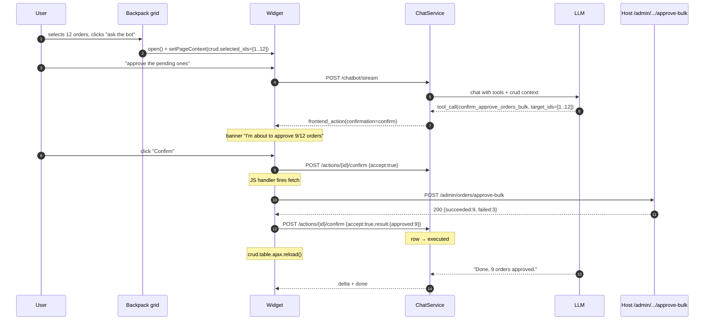

# Integration · Backpack CRUD

*English · [Español](backpack.es.md)*

> Recipes for hosts that use **Backpack** as their admin layer. Covers the
> page context provider included out-of-the-box with the package, the
> recommended `data-chatbot-*` conventions for Backpack grids, and an
> end-to-end bulk action example.
>
> Pre-reading: [`page-context.md`](../page-context.md) (how the bot knows
> what the user is viewing) + [`FRONTEND_TOOLS.md`](../FRONTEND_TOOLS.md)
> (how the bot executes actions in the browser).

---

## 1. Why this doc?

Package pilots have their admins built with Backpack. Natural conversations
over a Backpack grid look like:

- *"Approve all selected orders."*
- *"Filter 2026 events with attendance > 50."*
- *"Show me the detail of the customer in the first row."*

For the LLM to reason about these cases, it needs to **know** which entity
you are editing, which filters are applied to the grid, and which rows (if
any) are selected. Backpack exposes that information through `app('crud')`;
the package ships a provider that reads it and places it in the page
context, plus a set of conventions the host can optionally adopt.

---

## 2. Activation

The integration is **opt-in by runtime presence**:

- If `class_exists('Backpack\\CRUD\\app\\Library\\CrudPanel\\CrudPanel')` at
  boot, `ChatbotServiceProvider` registers `BackpackPageContextProvider`
  and the Blade directive `@chatbotBackpackContext`.
- If Backpack is not installed, nothing is registered — the directive in
  non-admin layouts emits an empty string without failing.

You do not need to change `composer.json`; the package does **not** depend
on Backpack.

---

## 3. The `@chatbotBackpackContext` directive

Place this directive in your **admin layout** (typically
`vendor/backpack/crud/src/resources/views/ui/layouts/top_left_menu.blade.php`
or your app's custom layout), inside `<head>`:

```blade
<head>
    {{-- ... rest of your head ... --}}

    @chatbotBackpackContext

    {{-- CSRF meta, etc. --}}
</head>
```

> ⚠️ **Do not wrap `@chatbotBackpackContext` inside `@push('after_styles')`
> or any other `@push` that loads from the end of `<body>`.**
> Backpack flushes `@stack('after_styles')` while rendering `<head>`; if
> your partial is included at the end of the body (as
> `vendor/backpack/theme-tabler/.../scripts.blade.php` does), the push
> runs **after** the stack has already been flushed and the meta tag never
> reaches the DOM. Result: `document.querySelector('meta[name="chatbot:context"]')`
> returns `null` even if the provider resolved the schema correctly.
>
> Emit the directive **inline** at the exact location you want it:
>
> ```blade
> @once
> @chatbotBackpackContext
>
> @push('after_scripts')
>     <chatbot-widget data-endpoint="{{ route('chatbot.stream') }}" ...></chatbot-widget>
>     <script src="{{ asset(config('chatbot.widget.asset_path')) }}" defer></script>
> @endpush
> @endonce
> ```
>
> The widget accepts the `<meta>` anywhere in the DOM — it does not have to
> live inside `<head>`.

When on a Backpack page with a resolved `CrudPanel`, this renders something
like:

```html
<meta name="chatbot:context" content='{"crud":{"entity":"Order","entity_class":"App\\Models\\Order","action":"list","filters":{"status":"pending"},"selected_ids":[12,15,18]}}'>
```

On non-Backpack pages the directive emits nothing (the meta tag can be added
by another source, e.g. a public listing view).

### 3.1 Shape of the `crud` payload

```typescript
{
    crud: {
        entity?: string;        // Friendly name: 'Order' (not FQCN). v1.1.1.
        entity_class?: string;  // Model FQCN: 'App\\Models\\Order'. Only emitted
                                // when NOT redundant with `entity` (i.e. when
                                // Backpack custom entity_name differs from
                                // class_basename(model)).
        action?: string;        // 'list' | 'show' | 'create' | 'update' | 'delete' | your custom operation
        filters?:
            | Record<string, scalar>           // legacy / non-list: applied querystring
            | {                                 // list view with declared filters()
                  applied: Record<string, scalar>;
                  available: Array<{
                      name: string;
                      type?: string;            // 'dropdown' | 'date_range' | 'text' | ...
                      options?: Array<{value: string|number, label: string} | string>;
                  }>;
              };
        form?: {                                // only on create/update/edit
            selector: string;                   // Stable CSS selector based on the
                                                // `bp-section` contract from Backpack 5/6/7:
                                                // '[bp-section="crud-operation-create"] form'.
                                                // Works without view overrides or an id on
                                                // the real `<form>`. Pass it verbatim as
                                                // `fill_form({selector, fields, ...})`.
            fields: Array<{
                name: string;
                label: string;
                type: string;                   // 'text' | 'select' | 'datetime' | 'enum' | ...
                options?: Array<{value: string|number, label: string}>;
                options_truncated?: true;       // FK select whose target exceeds
                                                // chatbot.backpack.fk_options_cap: the LLM
                                                // must fall back to a read tool (`list_*`)
                                                // to resolve labels → ids.
                required?: true;
            }>;
        };
        selected_ids?: (int|string)[];          // bulk: comes from `entries[]` or `selected_ids[]`
    }
}
```

Empty fields are omitted to keep the meta tag compact. If everything is
empty, the directive emits nothing.

> **Change from v1.1.0**: `entity` previously emitted the FQCN
> (`App\\Models\\Order`). Since v1.1.1 it emits the friendly name (`Order`)
> to save LLM tokens; the FQCN is exposed as `entity_class` only when it
> adds information (Backpack custom `entity_name`). The new `form` field
> appears in `create`/`update`/`edit` and list filters now also enumerate
> the **available** ones so the LLM can reason about which column to filter
> before calling `fill_form`.
>
> **Change from v1.1.1 (1.1.2)**: `form.id` is replaced by
> `form.selector`. The fabricated `id` never reached the DOM because
> Backpack does not tag its `<form>` by default. The new `selector` relies
> on the `bp-section` contract emitted by Backpack 5/6/7 out of the box and
> works without overrides. FK select fields now also enumerate their
> `options` server-side up to `chatbot.backpack.fk_options_cap` (default
> 200); beyond that count the field carries `options_truncated: true` and
> the LLM must use a read tool to resolve.

### 3.2 Combining with your own data

If you have host-specific data to add to the page context in addition to the
CRUD payload, merge it in JS after boot:

```javascript
// In your admin bundle
window.addEventListener('chatbot:context-changed', () => {
    // The widget has already read the meta tag and applied {crud: ...}.
    // Now we add our own data:
    window.Chatbot.setPageContext({
        ui: {
            theme: document.documentElement.dataset.theme ?? 'light',
            sidebar_collapsed: document.body.classList.contains('sidebar-collapsed'),
        },
    });
});
```

Remember that `setPageContext` performs a **true shallow merge**: it does
not replace `crud`, it extends it.

---

## 4. `data-chatbot-*` conventions for Backpack grids

If you want the LLM to be able to **operate** on the grid (not just read
it), adopt these attributes in your list blade:

```blade
{{-- vendor/backpack/crud/src/resources/views/crud/list.blade.php --}}
<table id="crudTable"
       class="table table-striped"
       data-chatbot-grid="orders"
       data-chatbot-entity="{{ App\Models\Order::class }}">
    <thead>
        <tr>
            <th><input type="checkbox" data-chatbot-select-all></th>
            <th data-chatbot-column="id">ID</th>
            <th data-chatbot-column="customer">Customer</th>
            <th data-chatbot-column="total">Total</th>
            <th data-chatbot-column="status">Status</th>
        </tr>
    </thead>
    <tbody>
        @foreach($entries as $entry)
            <tr data-chatbot-row data-chatbot-row-id="{{ $entry->id }}">
                <td><input type="checkbox" name="entries[]" value="{{ $entry->id }}"></td>
                <td>{{ $entry->id }}</td>
                <td>{{ $entry->customer->name }}</td>
                <td>{{ $entry->total }} €</td>
                <td>{{ $entry->status }}</td>
            </tr>
        @endforeach
    </tbody>
</table>
```

| Attribute | On | Meaning |
|---|---|---|
| `data-chatbot-grid="orders"` | `<table>` | identifies the whole grid |
| `data-chatbot-entity="App\\Models\\Order"` | `<table>` | model FQCN (matching `crud.entity` in the context) |
| `data-chatbot-select-all` | `<thead>` checkbox | the grid's "select all" button |
| `data-chatbot-column="status"` | `<th>` | logical column name |
| `data-chatbot-row` | `<tr>` | actionable row |
| `data-chatbot-row-id="42"` | `<tr>` | record id |

Built-in catalogue frontend tools that benefit:

- `toggle_visibility` with `target="[data-chatbot-grid]"` shows/hides the
  grid.
- `fill_form` with `target="filtersForm"` fills the grid filters.
- `render_block` with `data.row_id` lets you respond with an inline
  card/table in chat referencing the row the user is looking at.

---

## 5. Create / update forms

When the LLM needs to fill a Backpack `<form>` (Create mission, Edit
invoice, etc.), the `fill_form` primitive needs:

1. A stable way to **locate** the `<form>` on the page.
2. To know the HTML `name` of each control and, for FK selects, which
   integer value to expect for each label the user might say.

### 5.1 Form schema in page context (automatic)

`BackpackPageContextProvider` emits `crud.form.{selector, fields[...]}`
when `action ∈ {create, update, edit}`. Each field exposes
`{name, label, type, options?, options_truncated?, required?}`, and FK
selects serialise options as `[{value, label}]` so the LLM can map
"Mars" → "2" without guessing.

The `selector` is based on the stable `bp-section` contract that Backpack
5/6/7 emits in `crud::create.blade.php` /
`crud::edit.blade.php` / `crud::inc.form_page.blade.php`:

```html
<div class="row" bp-section="crud-operation-create">
    <form action="/admin/mission" method="post">...</form>
</div>
```

`'[bp-section="crud-operation-create"] form'` matches the correct form
without view overrides, without needing to tag the `<form>` with an `id` or
`data-chatbot-form`, and works equally for `create` / `update` / custom
HasForm operations.

This is out-of-the-box: with `chatbot:install` and
`class_exists('Backpack\\CRUD\\...')` detected, the provider does its job on
every CRUD route in the host. No tagging required.

Example of what the LLM sees in `## Current page` when on
`/admin/mission/create`:

```json
{
  "crud": {
    "entity": "Mission",
    "action": "create",
    "form": {
      "selector": "[bp-section=\"crud-operation-create\"] form",
      "fields": [
        {"name": "origin_planet_id", "label": "Origin planet", "type": "select",
         "options": [{"value": 1, "label": "Earth"}, {"value": 2, "label": "Mars"}]},
        {"name": "departure_at", "label": "Departure at", "type": "datetime"},
        {"name": "priority", "label": "Priority", "type": "enum",
         "options": [{"value": "standard", "label": "Standard"}]}
      ]
    }
  }
}
```

With that the LLM can call:

```json
{
  "tool": "fill_form",
  "args": {
    "selector": "[bp-section=\"crud-operation-create\"] form",
    "fields": [
      {"name": "origin_planet_id", "value": 1},
      {"name": "departure_at", "value": "2026-08-15T08:30"},
      {"name": "priority", "value": "express"}
    ]
  }
}
```

— passing the `selector` verbatim, with the correct HTML `name` attributes
and values already mapped from label to id.

> **Oversized FKs**: if the table referenced by a select exceeds
> `chatbot.backpack.fk_options_cap` (default 200), the provider emits the
> field with `options_truncated: true` and omits `options`. The LLM must
> fall back to a read tool (`list_planets`, `list_ships`, …) to resolve
> the label → id pair before calling `fill_form`.

### 5.2 Tagging the `<form>` (optional, rarely needed)

Because the `bp-section`-based `selector` covers the default case without
overrides, most hosts do not need to tag anything. If for some reason you
need targeting by id (e.g. your app has multiple forms on the same URL with
the same `bp-section`), you can publish this override:

```blade
{{-- resources/views/vendor/backpack/crud/inc/form_page.blade.php --}}
<form
    method="..."
    action="..."
    data-chatbot-form="{{ \Illuminate\Support\Str::kebab(class_basename($crud->getModel())) }}-{{ $operation }}">
    ...
</form>
```

> ⚠️ The `form_page.blade.php` partial override **only applies to custom
> operations based on the `HasForm` trait** — Backpack 6.x's built-in views
> `crud::create.blade.php` and `crud::edit.blade.php` have the `<form>`
> inline and do not include `form_page`. For those cases prefer `selector`
> (out-of-the-box) or publish overrides of `create.blade.php` /
> `edit.blade.php`. The `--backpack-forms` flag of `chatbot:install` remains
> as legacy support.

### 5.3 Aliases with `data-chatbot-field`

For fields with an ugly internal HTML `name` (`metadata[options][0][value]`)
the host can expose a friendly alias:

```html
<input name="metadata[options][0][value]" data-chatbot-field="first_option">
```

The LLM sees `first_option` in the page context (when you declare the alias
in the provider schema or in `@chatbotForm`) and `fillForm` looks up
`[data-chatbot-field]` before `[name]`. If it calls with a name that does
not exist, the "field not found" warning lists BOTH sets (`name` and
`data-chatbot-field`) for diagnostics.

### 5.4 Confirmation flow

`fill_form` defaults to `confirmation=confirm` — the widget shows a banner
before filling / submitting. A good default for destructive flows. If you
want to allow auto-fill without a banner (e.g. a draft the user reviews
before submitting), subclass `FillFormTool` and override `confirmation()` to
return `ConfirmationLevel::Auto`.

### 5.5 `chatbot:install --backpack-forms` command *(legacy)*

```
php artisan chatbot:install --backpack-forms
```

Copies the stub to `resources/views/vendor/backpack/crud/inc/form_page.blade.php`.
Idempotent — if the file already exists it does not overwrite without
`--force`. The flag is opt-in (it does not appear in the interactive wizard)
because it overwrites a host-specific view and that decision should be
explicit.

> **v1.1.2 — reduced relevance.** After the landing of `crud.form.selector`
> based on `bp-section`, this override only adds value for custom HasForm
> operations where you want to tag the `<form>` with a stable
> `data-chatbot-form`. The built-in views `crud::create.blade.php` and
> `crud::edit.blade.php` do **not** invoke `inc.form_page`, so the override
> does not affect them.

To apply it manually: copy the contents of
`src/Console/Commands/stubs/backpack-form-page.stub` to your override and
adjust as needed.

---

## 6. End-to-end example · Bulk approve with confirmation

> **Scenario**: the user has 12 orders selected in the Backpack grid and
> asks the bot "approve all pending ones". The bot must:
>
> 1. Read `selected_ids` from the page context.
> 2. Filter to those with `pending` status.
> 3. Ask the user for confirmation ("I'm about to approve 9 of the 12
>    selected orders…").
> 4. On confirmation, execute the real backend tool.
> 5. Refresh the grid.

### 6.1 Backend tool — `ApproveOrdersBulkTool`

Standard bulk pattern (see [`backend-tools.md`](../backend-tools.md)):

```php
namespace App\Chatbot\Tools;

use App\Models\Order;
use Rnkr69\LaraChatbot\Authorization\AccessScope;
use Rnkr69\LaraChatbot\Tools\BaseBackendTool;
use Rnkr69\LaraChatbot\Tools\ToolContext;
use Rnkr69\LaraChatbot\Tools\ToolResult;

class ApproveOrdersBulkTool extends BaseBackendTool
{
    public function name(): string { return 'approve_orders_bulk'; }

    public function description(): string
    {
        return 'Bulk-approves several orders by their IDs. Use this tool '
             . 'when the user asks to approve more than one order at a time '
             . '(selected in the grid or explicitly enumerated).';
    }

    public function parameters(): array
    {
        return [
            'type' => 'object',
            'properties' => [
                'target_ids' => [
                    'type' => 'array',
                    'description' => 'List of order IDs to approve (max 100).',
                ],
                'reason' => [
                    'type' => 'string',
                    'description' => 'Optional reason for the audit log.',
                ],
            ],
            'required' => ['target_ids'],
        ];
    }

    public function permissions(): array { return ['orders.approve']; }

    public function defaultScope(): AccessScope { return AccessScope::Team; }

    public function handle(array $args, ToolContext $ctx): ToolResult
    {
        $ids = array_slice((array) $args['target_ids'], 0, 100);

        $orders = $this->accessibleQuery(Order::query(), $ctx)
            ->whereIn('id', $ids)
            ->where('status', 'pending')   // pending only
            ->lockForUpdate()
            ->get()
            ->keyBy('id');

        $succeeded = $failed = [];

        foreach ($ids as $id) {
            $order = $orders->get($id);
            if (! $order) {
                $failed[] = ['id' => $id, 'reason' => 'not_pending_or_not_owner'];
                continue;
            }
            try {
                $order->approve($args['reason'] ?? null);
                $succeeded[] = ['id' => $id];
            } catch (\Throwable $e) {
                $failed[] = ['id' => $id, 'reason' => 'runtime'];
            }
        }

        return ToolResult::success([
            'requested' => count($ids),
            'succeeded' => $succeeded,
            'failed'    => $failed,
            'counts'    => [
                'ok'   => count($succeeded),
                'fail' => count($failed),
            ],
        ]);
    }
}
```

### 6.2 Frontend tool with confirmation — `ConfirmApproveOrdersBulkTool`

> **Why two tools**: in v1 backend tools do not support
> `confirmation=confirm`. The canonical pattern is: a FE tool with
> `confirmation=confirm` that receives the args, shows the banner, and upon
> confirmation triggers the BE tool.

```php
namespace App\Chatbot\Tools;

use Rnkr69\LaraChatbot\Tools\BaseFrontendTool;
use Rnkr69\LaraChatbot\Tools\ConfirmationLevel;
use Rnkr69\LaraChatbot\Tools\ToolContext;
use Rnkr69\LaraChatbot\Tools\ToolResult;

class ConfirmApproveOrdersBulkTool extends BaseFrontendTool
{
    public function name(): string { return 'confirm_approve_orders_bulk'; }

    public function description(): string
    {
        return 'Asks the user for confirmation before approving several orders. '
             . 'Call this tool when the user asks to approve ≥2 orders.';
    }

    public function parameters(): array
    {
        return [
            'type' => 'object',
            'properties' => [
                'target_ids' => ['type' => 'array'],
                'preview'    => ['type' => 'string', 'description' => 'Text to show in the banner.'],
            ],
            'required' => ['target_ids', 'preview'],
        ];
    }

    public function permissions(): array { return ['orders.approve']; }

    public function confirmation(): ConfirmationLevel
    {
        return ConfirmationLevel::Confirm;
    }
}
```

### 6.3 JS handler — receives the "confirmed" event and triggers the BE tool

The widget already manages the banner. When the user confirms, it emits the
second call to the endpoint with `result.done`. The primitive itself —
invoking the real backend tool — is executed from JS so the LLM can receive
the result in the next turn:

```javascript
window.Chatbot.registerTool('confirm_approve_orders_bulk', async ({ target_ids }) => {
    // The user has ALREADY confirmed (the widget only invokes the handler after
    // {accept: true}); we execute the real BE tool.
    const csrf = document.querySelector('meta[name="csrf-token"]').content;

    const res = await fetch('/admin/orders/approve-bulk', {
        method: 'POST',
        credentials: 'same-origin',
        headers: {
            'Content-Type': 'application/json',
            'X-CSRF-TOKEN': csrf,
            'Accept': 'application/json',
        },
        body: JSON.stringify({ target_ids }),
    });

    if (! res.ok) {
        return { success: false, error: `http_${res.status}` };
    }

    const data = await res.json();

    // Refresh the grid (Backpack uses DataTables)
    if (window.crud?.table) {
        window.crud.table.ajax.reload();
    }

    return {
        success: true,
        approved: data.succeeded.length,
        failed: data.failed.length,
    };
});
```

### 6.4 Host endpoint called by JS

```php
// routes/admin.php (or wherever your app places Backpack routes)
Route::middleware(['auth', 'web'])
    ->post('/admin/orders/approve-bulk', function (Request $request) {
        // Reuse the backend tool (identical authorization cascade)
        $tool = app(ApproveOrdersBulkTool::class);

        $ctx = new \Rnkr69\LaraChatbot\Tools\ToolContext(
            user: $request->user(),
            conversation: null,
            pageContext: [],
        );

        $result = $tool->execute(
            $request->validate(['target_ids' => 'array', 'reason' => 'nullable|string']),
            $ctx,
        );

        return response()->json($result->toArray(), $result->isOk() ? 200 : 422);
    });
```

> Here we call `execute()` (not `handle()`) directly; the authorization
> cascade applies exactly as when the call comes from the LLM. If you want
> to expose it *without* the cascade — because you already validated with a
> host middleware — call `handle()` directly.

### 6.5 Custom typed block — `crud_row`

So the bot can display a grid row in chat in a rich format (instead of
listing it as markdown), the host registers a block renderer:

```javascript
window.Chatbot.registerBlockRenderer('crud_row', (block, container) => {
    const { entity_label, fields, actions } = block.data;

    container.innerHTML = `
        <div class="cb-crud-row">
            <h4>${escapeHtml(entity_label)}</h4>
            <dl>
                ${Object.entries(fields).map(([k, v]) =>
                    `<dt>${escapeHtml(k)}</dt><dd>${escapeHtml(String(v))}</dd>`
                ).join('')}
            </dl>
            ${actions ? `
                <div class="cb-crud-actions">
                    ${actions.map(a => `
                        <button data-action="${a.tool}" data-args='${JSON.stringify(a.args)}'>
                            ${escapeHtml(a.label)}
                        </button>
                    `).join('')}
                </div>
            ` : ''}
        </div>
    `;

    container.querySelectorAll('button[data-action]').forEach(btn => {
        btn.addEventListener('click', () => {
            const tool = btn.dataset.action;
            const args = JSON.parse(btn.dataset.args);
            window.Chatbot.invokeTool(tool, args);
        });
    });
});

function escapeHtml(s) {
    const div = document.createElement('div');
    div.textContent = s;
    return div.innerHTML;
}
```

The LLM emits the block from a host tool:

```php
// app/Chatbot/Tools/GetOrderTool.php
public function handle(array $args, ToolContext $ctx): ToolResult
{
    $order = Order::find($args['order_id']);
    return ToolResult::success([
        'block' => [
            'type' => 'crud_row',
            'data' => [
                'entity_label' => "Order #{$order->id}",
                'fields' => [
                    'Customer' => $order->customer->name,
                    'Total'    => "{$order->total} €",
                    'Status'   => $order->status,
                ],
                'actions' => [
                    ['tool' => 'open_invoice_drawer', 'args' => ['invoice_id' => $order->invoice_id], 'label' => 'View invoice'],
                    ['tool' => 'confirm_approve_orders_bulk', 'args' => ['target_ids' => [$order->id], 'preview' => 'Approve this order'], 'label' => 'Approve'],
                ],
            ],
        ],
    ]);
}
```

Typed block details in [`block-renderers.md`](../block-renderers.md).

---

## 7. Full flow — diagram



---

## 8. Additional recipes

### 8.1 Filter the grid from the LLM response

```javascript
window.Chatbot.registerTool('apply_grid_filter', ({ filters }) => {
    if (! window.crud?.table) {
        return { success: false, error: 'no_grid' };
    }
    Object.entries(filters).forEach(([col, val]) => {
        window.crud.table.column(`${col}:name`).search(val);
    });
    window.crud.table.draw();
    return { success: true };
});
```

The LLM can emit:
```
tool_call(apply_grid_filter, {filters: {status: 'pending', priority: 'high'}})
```

### 8.2 Open a detail drawer

If your app has Backpack drawers (lateral sidebar with detail):

```javascript
window.Chatbot.registerTool('open_crud_show', ({ entity, id }) => {
    const url = `/admin/${entityToSlug(entity)}/${id}/show`;
    if (window.Inertia) {
        window.Inertia.visit(url, { preserveScroll: true });
    } else {
        window.location.assign(url);
    }
    return { success: true };
});
```

The LLM can emit from a block `actions`:
```
tool_call(open_crud_show, {entity: 'App\\Models\\Order', id: 42})
```

### 8.3 Refresh the page after a mutation

The built-in primitives include `navigate` with `reload`. To refresh
*without* navigating:

```javascript
window.Chatbot.registerTool('refresh_grid', () => {
    if (window.crud?.table) {
        window.crud.table.ajax.reload(null, false);
        return { success: true };
    }
    window.location.reload();
    return { success: true };
});
```

---

## 9. Backpack-specific troubleshooting

### B1 · The directive emits nothing

**Cause**: you are not on a Backpack page or `app('crud')` is not bound for
that request.

**Check**:
```php
// In your controller/middleware
if (app()->bound('crud') && ($panel = app('crud')) !== null) {
    dump('ok', $panel->getModel());
}
```

If the above works but `@chatbotBackpackContext` still emits nothing, open
an issue on the package repo with your Backpack version and a panel dump.

### B2 · `selected_ids` always empty

**Cause**: your grid uses a different field name. The provider reads
`entries[]` and `selected_ids[]` by default.

**Fix**: extend the provider in your host:

```php
namespace App\Chatbot\Authorization;

use Rnkr69\LaraChatbot\Integrations\Backpack\BackpackPageContextProvider;

class CustomBackpackProvider extends BackpackPageContextProvider
{
    protected function resolveSelectedIds(): array
    {
        $ids = parent::resolveSelectedIds();
        if ($ids === []) {
            $ids = array_filter((array) request()->input('my_custom_field', []));
        }
        return $ids;
    }
}
```

```php
// AppServiceProvider::register()
$this->app->singleton(
    \Rnkr69\LaraChatbot\Integrations\Backpack\BackpackPageContextProvider::class,
    \App\Chatbot\Authorization\CustomBackpackProvider::class,
);
```

### B3 · The meta tag escapes strange characters

**Cause**: your CrudPanel returns models with properties containing
`<`, `>`, `&` etc.

**Expected**: the provider uses `JSON_HEX_QUOT|JSON_HEX_APOS` so the JSON
can be wrapped with `'…'` without manual escaping. Unicode characters pass
through unescaped.

**Fix if you see a corrupted meta tag**: your model likely has a property
with invalid UTF-8 bytes. Check the column in the database.

---

## 10. Known limitations

- The provider does **not** read filters saved in the session (Backpack
  persistence). If you depend on that, extend the provider.
- `getModel()` in `create` operations may return an "empty" instance — the
  friendly `entity` name is still resolved from `entity_name` or
  `class_basename`; the `form` schema is still emitted because
  `$panel->fields()` is defined in the operation.
- The `chatbot:context-changed` event fires after *every* `setPageContext`
  call. If Backpack calls `Crud::setEntityNameStrings(...)` multiple times
  during panel boot, only the last one matters: the directive runs at the
  end of the head once everything is stable.

---

## 11. References

- Provider: `src/Integrations/Backpack/BackpackPageContextProvider.php`
- Directive: `src/Integrations/Backpack/BladeHelpers.php`
- Block catalogue: [`block-renderers.md`](../block-renderers.md)
- Bulk pattern: [`backend-tools.md`](../backend-tools.md)
- Confirmations: [`confirmation-flow.md`](../confirmation-flow.md)
